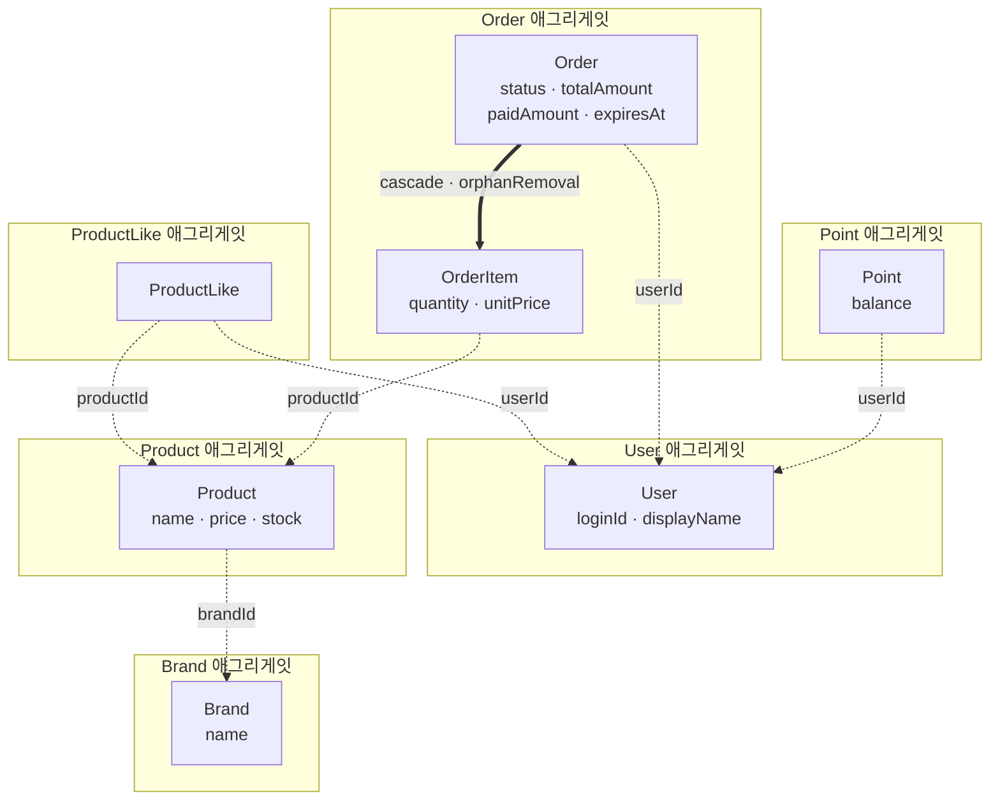

# 커머스 기본 기능 · 설계 (W2)

- 기획 문서: [commerce-basics-plan.md](./commerce-basics-plan.md) — `P-xx`(정책) · `D-xx`(기획 결정) 번호는 그 문서를 가리킵니다
- 이 문서가 붙이는 번호: `DS-xx` (설계 결정)
- 작성자 / 작성일: 홍예슬 / 2026-09-20 (2차 개정 — 구현 1단계 검토 반영: DS-9 ~ DS-12)

---

## 0. 이 문서가 정하는 것

기획 문서가 **무엇을·왜**까지 정했습니다. 이 문서는 **어떻게**를 정합니다.

### 0-1. 기획의 입력과 설계 결정

| 기획의 입력 | 이 문서의 결정 |
| --- | --- |
| P-10 상품 응답에 브랜드·좋아요 수, P-15 좋아요 수는 관계에서 센다 | **DS-1** 상품의 상태·규칙과 조회 결과 조합을 어디에 두나 |
| P-25 중복 품목 거절, D-1 | **DS-2** 중복 품목 검사를 어느 계층에 |
| P-13 삭제 방식이 대상마다 다름, D-2 | **DS-3** 논리 삭제와 물리 삭제를 코드에서 어떻게 구분하나 |
| P-32 DRAFT 10분 만료, D-7 | **DS-4** 만료를 확정 검사와 배치에 어떻게 나누나 |
| P-33 관리자 응답이 더 자세함, D-10 | **DS-5** 응답 모델을 고객·관리자로 어떻게 나누나 |
| P-34·P-35 개인정보 경계, D-12 | **DS-6** 마스킹과 조회 기록을 어느 계층에 두나 |
| P-27 확정 거절 시 전부 원복 | **DS-7** 확정의 트랜잭션 경계와 검사 순서 |
| 1주차 관찰 — 오류 코드에 상태 코드 이상의 정보가 없다 | **DS-8** 오류 식별자 체계 |
| P-01 `X-USER-ID` 로 요청자를 식별한다 | **DS-9** `X-USER-ID` 가 담는 값과 그 형식 |
| P-13 삭제 방식이 대상마다 다름, D-2 | **DS-10** 공통 엔티티를 논리 삭제 여부로 나눈다 |
| P-36~P-39 상품 판매 상태, D-14 | **DS-11** 판매 상태를 어디까지 저장하나 |
| P-18~P-22 포인트, P-40 | **DS-12** 포인트를 잔액으로만 들지, 원장으로 들지 |

### 0-2. 이 문서에 적지 않는 것

**인터페이스 시그니처를 전부 적지 않습니다.** 과제가 설계 문서에 요구한 것은 버드뷰 · 도메인 관계 · 대표 흐름 · API 계약 넷이고 시그니처는 그 안에 없습니다. 더 중요한 이유는 비용입니다.

| 적으면 | 무엇이 문제인가 |
| --- | --- |
| `BrandFacade.get(id): BrandInfo` 같은 평범한 시그니처 | 구현하면서 반드시 바뀝니다. 문서를 같이 고치지 않으면 **문서가 거짓말을 시작합니다** |
| API 요청·응답 필드 전체 | 템플릿에 이미 `*V1ApiSpec` + springdoc 이 있습니다. 같은 것을 두 곳에서 말하면 갈라집니다 |

**적는 기준: 시그니처 자체가 정책을 강제하는 것만 적습니다.**

| 적는 것 | 왜 |
| --- | --- |
| `getUnmasked(target, requester, purpose)` | `purpose` 가 필수 파라미터라서 **목적 없는 조회를 호출할 수 없습니다** (DS-6) |
| `findAlive(id)` — `findById` 를 두지 않음 | 이름이 조건을 들고 있어 빠뜨림을 막습니다 (DS-3) |
| `ProductRepository.findAliveProducts(criteria)` | 이름이 "살아 있고 판매중인 것만"(P-12 · P-39)을, KDoc 이 정렬 계약(P-09)을 들고 있습니다 (DS-1 · DS-3) |

**패키지 구조는 적습니다**(8절). 파일이 어디 생기는지는 구현 전에 합의가 필요하고, 한번 정하면 잘 바뀌지 않습니다. 시그니처는 자주 바뀝니다. 그 차이입니다.

**API 인터페이스 문서는 코드가 만듭니다.** 템플릿의 `ExampleV1ApiSpec` 이 그 자리이고 springdoc 이 Swagger(`/swagger-ui.html`)로 보여줍니다. 이 문서 6절은 **계약**(입력 · 성공 · 대표 오류 · 기대값)까지이고, 필드 하나하나는 `*V1ApiSpec` 이 담당합니다. 문서가 필드 목록을 또 적으면 구현이 바뀔 때 어느 쪽이 맞는지 알 수 없게 됩니다.

---

## 1. 버드뷰

### 1-1. 요청 방향

```
   고객                                관리자
   X-USER-ID: 1                        ROLE_ADMIN
      │                                   │
      │  /api/v1/**                       │  /api-admin/v1/**
      ▼                                   ▼
┌──────────────────────────────────────────────────────┐
│                    commerce-api                      │
│                                                      │
│  interfaces ──▶ application ──▶ domain ◀── infra     │
│                                              │       │
└──────────────────────────────────────────────┼───────┘
                                               │ JPA
                                               ▼
                                          ┌─────────┐
                                          │  MySQL  │
                                          └─────────┘

┌──────────────────────────────────────────────────────┐
│               commerce-batch (DS-4)                  │
│   만료된 DRAFT 를 EXPIRED 로 정리                     │
└──────────────────────────────────────────────┼───────┘
                                               ▼  같은 DB
```

- 요청은 항상 한 방향입니다. DB가 API를 부르는 일은 없습니다.
- 관리자 경계는 `AdminBoundaryConfig` 의 `securityMatcher("/api-admin/**")` 가 만듭니다. 고객 경로는 이 필터체인 밖입니다.
- `commerce-batch` 는 같은 DB를 보지만 HTTP로 `commerce-api` 를 부르지 않습니다. 만료 판단 규칙은 domain 에 있고 두 애플리케이션이 그 코드를 공유하는 것이 아니라, **각자 자기 domain 코드를 가집니다**(지금은 batch 가 자체 tasklet 으로 UPDATE). 이 중복은 DS-4 에서 다룹니다.

### 1-2. 계층 역할과 허용 방향

`AGENTS.md` 가 정한 방향을 그대로 씁니다.

```
interfaces ──▶ application ──▶ domain ◀── infrastructure
```

| 계층 | 맡는 일 | 두는 것 | 두지 않는 것 |
| --- | --- | --- | --- |
| `interfaces` | HTTP 입력을 값으로 바꾸고, 결과를 응답으로 바꾸고, 오류를 상태 코드로 매핑 | Controller, ApiSpec, Dto, ArgumentResolver | 업무 규칙, `infrastructure` 의존, domain 의 `Service`·`Repository` 직접 호출 |
| `application` | 유스케이스 하나의 순서와 트랜잭션 경계 | Facade, Info, Command/Criteria | HTTP 개념(상태 코드·헤더), JPA 개념, 상태 변경 규칙 자체 |
| `domain` | 상태와 규칙, 그리고 필요한 저장 약속 | Entity, Service, Repository 인터페이스, 값 객체 | Spring MVC·JPA 구현 세부, 응답 형태 |
| `infrastructure` | 저장 약속의 JPA·QueryDSL 구현 | JpaRepository, RepositoryImpl, QueryDsl 조회 | HTTP 응답 정책, domain 규칙의 중복 구현 |

**"규칙은 domain, 순서는 application"** 이 이 문서 전체를 지배하는 한 줄입니다.
`Product` 가 "재고 6개는 못 뺀다"를 알고, `OrderFacade` 가 "재고를 먼저 보고 그다음 잔액을 본다"를 압니다.

### 1-3. ArchUnit 규칙

기존 세 규칙을 유지하고 **한 개를 더합니다**.

| # | 규칙 | 상태 |
| --- | --- | --- |
| 1 | `domain` 은 `interfaces`·`application`·`infrastructure` 에 의존하지 않는다 | 기존 |
| 2 | `application` 은 `interfaces`·`infrastructure` 에 의존하지 않는다 | 기존 |
| 3 | `interfaces` 는 `infrastructure` 에 의존하지 않는다 | 기존 |
| 4 | **`interfaces` 는 `..domain..` 의 `*Service`·`*Repository` 에 의존하지 않는다** | **추가 · 1단계에서 넣음** |

4번을 더한 이유: 1~3번만으로는 Controller 가 `ProductService` 를 직접 불러 `application` 을 건너뛰는 것을 막지 못합니다.
`interfaces` 가 domain 의 **값**(enum, 값 객체)을 쓰는 것은 허용합니다 — 정렬 값 같은 도메인 어휘를 입력으로 받는 자리에서 불필요한 우회를 만들지 않기 위해서입니다. 막는 것은 **행동과 저장**입니다.

`domain` 전체를 금지하지 않은 것이 이 규칙의 판단입니다. 더 세게 막으면 `ProductSort` 를 `application` 에 복제해야 하고, 그 복제가 새로운 불일치를 만듭니다.
1단계에서 `UserIdArgumentResolver` 가 `LoginId`(값 객체)를 쓰는 것이 이 허용의 첫 사례입니다 — DS-9.

**4번을 9단계가 아니라 1단계에 넣었습니다.** 규칙이 없는 동안 쌓인 위반을 마지막에 한꺼번에 고치는 것보다, `interfaces` 에 첫 파일이 생길 때 걸어두고 2단계부터 어기지 않는 쪽이 쌉니다.

---

## 2. 도메인 관계

### 2-1. DB 관계

```mermaid
erDiagram
    USER  ||--o|  POINT : "잔액 1:1"
    USER  ||--o{  POINT_TRANSACTION : "포인트 원장"
    USER  ||--o{  PRODUCT_LIKE : "좋아요"
    USER  ||--o{  ORDERS : "주문"
    USER  ||--o{  PERSONAL_DATA_ACCESS_LOG : "누구를 — 조회당한 고객"
    ADMIN_USER ||--o{ ADMIN_USER_ROLE : "역할 (다대다)"
    ADMIN_USER ||--o{ ADMIN_ROLE_HISTORY : "누구의 — 역할이 바뀐 관리자"
    ADMIN_USER ||--o{ ADMIN_ROLE_HISTORY : "누가 — 역할을 바꾼 관리자"
    ADMIN_USER ||--o{ PERSONAL_DATA_ACCESS_LOG : "누가 — 조회한 관리자"
    BRAND ||--o{  PRODUCT : "소속"
    PRODUCT ||--o{ PRODUCT_LIKE : "좋아요 대상"
    PRODUCT ||--o{ ORDER_ITEM : "품목 대상"
    ORDERS  ||--|{ ORDER_ITEM : "품목"
    ORDERS  ||--o{ POINT_TRANSACTION : "결제 근거"

    USER {
        bigint id PK
        varchar login_id UK "X-USER-ID 로 받는 값 · 영문·숫자 1~20자 · DS-9"
        varchar display_name
        varchar status "ACTIVE DEACTIVATED BLOCKED WITHDRAWN · P-41 · D-15"
        datetime created_at
        datetime updated_at
    }

    BRAND {
        bigint id PK
        varchar name "1~100자"
        datetime created_at
        datetime updated_at
        datetime deleted_at "논리 삭제 · D-2 · SoftDeletableEntity"
    }

    PRODUCT {
        bigint id PK
        bigint brand_id FK "ID 참조 · 단방향"
        varchar name "1~100자 · P-06"
        bigint price "0 이상 1억 이하 · P-06"
        int stock "0 이상 · P-07"
        varchar status "ON_SALE SUSPENDED DISCONTINUED · P-36 · DS-11"
        datetime created_at
        datetime updated_at
        datetime deleted_at "논리 삭제 · D-2 · SoftDeletableEntity"
    }

    PRODUCT_LIKE {
        bigint id PK
        bigint user_id FK "user_id + product_id UNIQUE · P-14"
        bigint product_id FK
        datetime created_at
        datetime updated_at
    }

    POINT {
        bigint id PK
        bigint user_id FK "UNIQUE"
        bigint balance "0 이상 10억 이하 · P-20 · 원장의 파생값 · DS-12"
        datetime created_at
        datetime updated_at
    }

    POINT_TRANSACTION {
        bigint id PK
        bigint user_id FK
        varchar type "CHARGE USE · P-40"
        bigint amount "부호 없는 크기"
        bigint balance_after "기록 시점 잔액 · 대사용"
        bigint order_id FK "USE 일 때만 · 환불의 근거 · DS-12"
        datetime created_at
        datetime updated_at
    }

    ORDERS {
        bigint id PK
        bigint user_id FK
        varchar status "DRAFT CONFIRMED CANCELED EXPIRED"
        bigint total_amount "품목 합계 · P-28"
        bigint paid_amount "확정 시 차감액 · 0 가능 · P-30"
        datetime expires_at "생성 + 10분 · DS-4"
        datetime confirmed_at
        datetime canceled_at
        datetime created_at
        datetime updated_at
    }

    ORDER_ITEM {
        bigint id PK
        bigint order_id FK "애그리게잇 내부 · 객체 참조"
        bigint product_id FK "ID 참조"
        int quantity "1 이상 · P-24"
        bigint unit_price "주문 시점 복사 · P-28"
        datetime created_at
        datetime updated_at
    }

    ADMIN_USER {
        bigint id PK
        varchar login_id UK "ROLE_ADMIN 경계의 Authentication.name · D-16"
        varchar display_name
        varchar status "ACTIVE SUSPENDED RETIRED · P-43"
        datetime created_at
        datetime updated_at
    }

    ADMIN_USER_ROLE {
        bigint admin_user_id PK "admin_user_id + role 복합 PK"
        varchar role PK "SUPER_ADMIN CATALOG_ADMIN ORDER_ADMIN CS_ADMIN · P-43"
    }

    ADMIN_ROLE_HISTORY {
        bigint id PK
        bigint admin_user_id FK "누구의 — 역할이 바뀐 관리자 · ADMIN_USER"
        varchar role "어느 역할"
        varchar action "GRANTED REVOKED"
        bigint actor_id FK "누가 — 역할을 바꾼 관리자 · ADMIN_USER · 둘은 같을 수 없다 · P-44"
        datetime created_at "언제 · 3년 보관 · P-44"
        datetime updated_at
    }

    PERSONAL_DATA_ACCESS_LOG {
        bigint id PK
        bigint actor_id FK "누가 — 조회한 관리자 · ADMIN_USER"
        bigint target_user_id FK "누구를 — 조회당한 고객 · USER"
        varchar purpose "왜 — 문의 번호 등 · 필수 · P-35"
        datetime accessed_at "언제"
        datetime created_at
        datetime updated_at
    }
```



`order` 와 `like` 는 SQL 예약어라 테이블 이름을 `orders` · `product_like` 로 둡니다.

**`deleted_at` 은 `brand` 와 `product` 에만 있습니다.** 나머지는 논리 삭제 대상이 아니라서
컬럼 자체를 갖지 않습니다 — `SoftDeletableEntity` 를 상속하지 않기 때문입니다 (DS-10).
쓰지 않을 컬럼을 두면 쓰면 안 되는 자리에서 `delete()` 가 호출될 수 있고, 그 호출은 조용히 성공합니다.

#### `personal_data_access_log` 는 관리자가 쓰는 기록입니다

**참여자가 둘입니다.** 한쪽만 그리면 절반을 놓칩니다.

| 컬럼 | 누구 | 어느 테이블 |
| --- | --- | --- |
| `actor_id` | **누가 봤나** | `ADMIN_USER` (D-16) |
| `target_user_id` | **누구를 봤나** | `USER` |

- **`actor_id` 가 `USER` 가 아닌 것이 이 테이블의 요점입니다.** 개인정보를 보는 쪽은 고객이 아니라 운영자이고, D-12 의 의무가 걸리는 쪽도 그쪽입니다. 관리자가 `user` 테이블에 섞여 있었다면 "누가 봤나"와 "누구를 봤나"가 같은 테이블을 가리켜 구분이 흐려집니다.
- **외래 키가 끊어질 일이 없습니다.** `AdminUser` 는 지우지 않고 퇴사도 상태로 다룹니다(P-43 · D-16). 감사 기록이 **행위자를 잃지 않는다**는 것이 그 결정에서 따라오는 성질입니다 — 지우는 설계였다면 퇴사한 순간 지난 조회 기록의 주인이 사라집니다.
- 이 FK 가 생겨서 "누가 봤나"를 사람 단위로 집계할 수 있고, 그래야 D-12 의 **월 1회 점검**이 실제로 가능해집니다.
- **쓰는 곳은 한 곳뿐입니다** — A-15 마스킹 해제 조회(`UserAdminFacade.getUnmasked`). 고객 API 는 이 테이블을 건드리지 않습니다. 기록을 `interfaces` 가 아니라 `application` 에 둔 이유가 이것입니다 (DS-6).
- **지우지 않습니다.** 접속기록은 1년 이상(경우에 따라 2년) 보관 의무가 있습니다 (기획 D-12). 그래서 `deleted_at` 도 없고 삭제 경로도 없습니다.

#### 무엇을 어떻게 지우나 — 한눈에

`deleted_at`(시각)과 `status`(상태)는 **다른 축**입니다. 섞어 쓰면 "지워졌는데 판매중"이 생깁니다.

| 대상 | 지우는 방법 | 무엇으로 | 왜 |
| --- | --- | --- | --- |
| `Brand` · `Product` | **논리 삭제** | `deleted_at` (`SoftDeletableEntity`) | 지난 주문이 가리키는 대상이라 행이 남아야 합니다 (D-2) |
| `ProductLike` | **물리 삭제** | `repository.delete(row)` | 취소한 좋아요는 복구·이력 대상이 아닙니다 (D-2). `delete()` 는 아예 없습니다 (DS-10) |
| `Order` · `OrderItem` | **지우지 않음** | 상태 전이 (`CANCELED` · `EXPIRED`) | 주문은 기록입니다. 취소는 삭제가 아닙니다 (P-29 · P-32) |
| `Point` · `PointTransaction` | **지우지 않음** | — | 원장은 append-only 입니다 (DS-12) |
| `PersonalDataAccessLog` · `AdminRoleHistory` | **지우지 않음** | — | 보관 의무가 있습니다 — 접속기록 1~2년, 권한 변경 내역 3년 (D-12). `AdminUser` 를 지우지 않는 것도 이 둘의 행위자가 사라지지 않게 하는 조건입니다 |
| `AdminUser` | **지우지 않음** | `status` (`SUSPENDED` · `RETIRED`) | 퇴사는 삭제가 아니라 상태입니다 (P-43 · D-16). `User` 와 같은 축 |
| `User` | **지우지 않음** | `status` (`BLOCKED` · `WITHDRAWN`) | 탈퇴는 숨기는 것이 아니라 상태다 (P-41 · D-15). 아래 참고 |

**`Product` 만 두 축을 다 가집니다.** `deleted_at`(카탈로그에서 없는 것)과 `status`(있지만 못 사는 것)는
직교합니다 — 단종된 상품도 삭제할 수 있고, 판매중인 상품도 삭제할 수 있습니다 (DS-11).

#### `User` 는 왜 지울 수 없나 — 그리고 나중에도 `deleted_at` 이 아닌 이유

이번 주에는 회원가입·탈퇴가 범위 밖이라(기획 3-2절) `User` 를 만드는 것도 fixture 뿐이고 **지우는 경로가 없습니다.**
그래서 `BaseEntity` 를 상속해 `deleted_at` 자체를 갖지 않습니다 (DS-10).

탈퇴·차단은 **`deleted_at` 이 아니라 `status` 로 다룹니다** (P-41 · 기획 D-15).

- 탈퇴는 "행을 안 보이게 한다"가 아니라 **개인정보 파기 시계를 시작한다**는 뜻입니다. 언제까지 무엇을 지울지가 따라옵니다 (기획 D-12).
- 정상 · 차단 · 탈퇴는 **서로 오가는 상태**입니다. 차단은 풀 수 있고 탈퇴는 최종입니다 — `ProductStatus` 와 같은 모양입니다 (DS-11).
- `deleted_at` 은 되돌림이 `restore()` 하나뿐이라 이 구분을 담지 못합니다.

그래서 `User` 는 `SoftDeletableEntity` 로 가지 않고 **`BaseEntity` 를 유지한 채 `status` 를 듭니다.**

**거절은 `UserService.getActiveOrThrow` 한 곳입니다.** 이름이 조건을 들고 있는 것은 `findAlive` 와 같은 이유입니다 (DS-3) —
`getOrThrow` 였다면 부르는 쪽이 상태를 봐야 하는지 스스로 판단해야 하고, 한 군데만 빠뜨려도 차단된 계정이 통과합니다.

**상태를 바꾸는 API 는 이번 주에 없습니다.** 규칙과 거절만 넣었고, 조작은 회원가입·로그인과 함께 옵니다 (기획 12절 9번).

### 2-2. 애그리게잇 경계와 참조 방식

DB 에서는 전부 외래 키지만, **코드에서는 두 종류로 갈립니다.**



| 선 | 뜻 | JPA |
| --- | --- | --- |
| 굵은 실선 | 같은 애그리게잇 안 — **객체 참조** | `@OneToMany(cascade = ALL, orphanRemoval = true)` |
| 점선 | 애그리게잇을 넘음 — **ID 참조** | 연관을 만들지 않고 `Long` 컬럼만 |

**애그리게잇을 넘을 때 ID 로만 참조하는 이유** 셋:

1. **경계 밖 객체의 상태를 실수로 바꿀 수 없습니다.** `OrderItem` 이 `Product` 객체를 들면, 주문 상세를 읽다가 상품을 수정할 길이 열립니다.
2. **조회 범위가 예측 가능합니다.** 객체 참조는 지연 로딩이 어디서 터질지 코드를 읽어야 알 수 있습니다. ID 참조는 "필요하면 내가 조회한다"가 명시적입니다.
3. **D-2(논리 삭제)와 P-28(금액 보존)이 요구하는 것과 맞습니다.** 삭제된 상품을 참조하는 주문이 그대로 읽힙니다. 연관이면 "삭제된 것을 걸러내는" 조건이 주문 조회에까지 번집니다.

`Order` → `OrderItem` 만 예외인 이유는 2-3절에 적습니다.

### 2-3. 각 관계를 그렇게 둔 이유

#### Brand — Product : `Product` 가 `brandId` 를 든다 (단방향)

- `Brand` 는 `Product` 컬렉션을 갖지 않습니다.
- **왜**: P-11(살아 있는 상품이 연결된 브랜드는 삭제 못 함)은 컬렉션을 순회해야 답하는 질문이 아니라 **"있냐 없냐"** 를 묻는 질문입니다. `productRepository.existsAliveByBrandId(brandId)` 한 줄로 끝납니다.
- **대안 — `@OneToMany` 양방향**: 브랜드 하나 조회에 상품 전체가 따라옵니다(또는 지연 로딩 관리가 필요). 컬렉션 동기화 책임이 생기고, `Brand` 가 상품 규칙을 알게 됩니다.
- **이 선택이 비싸지는 조건**: "브랜드와 그 상품들"을 한 번에 보여줄 화면이 생기면 조회를 두 번 하게 됩니다. 그때도 컬렉션을 매핑하기보다 조회 전용 모델(DS-1)로 읽는 쪽이 낫다고 봅니다.

#### User — ProductLike — Product : 관계를 독립 엔티티로

- `ProductLike(userId, productId)` 에 `UNIQUE (user_id, product_id)`.
- **왜**: P-14 가 "조합당 한 행", P-15 가 "좋아요 수는 관계에서 센다"를 요구합니다. 관계 자체가 도메인 개념이므로 엔티티로 둡니다.
- **`@ManyToMany` 를 쓰지 않는 이유** 셋:
  1. 조인 테이블을 JPA 가 관리하면 관계에 자기 정체성(생성 시각, 나중의 이력)을 줄 수 없습니다.
  2. 개수 세기가 `product.likes.size` 로 가고, 그러면 컬렉션을 로딩해야 합니다. P-15 를 지키면서 비싸집니다.
  3. D-2 가 좋아요를 **물리 삭제**로 정했습니다. 컬렉션에서 빼는 것과 행을 지우는 것을 구분해 제어하려면 엔티티가 있어야 합니다.
- **`Product` 에 `likeCount` 컬럼을 두지 않습니다.** P-15 위반이고, 등록·취소·상품 삭제 세 곳에서 숫자를 맞춰야 합니다.

#### Order — OrderItem : `Order` 가 애그리게잇 루트

- `OrderItem` 은 `Order` 를 통해서만 만들어지고 읽힙니다. `cascade = ALL`, `orphanRemoval = true`.
- **왜**: 품목 혼자로는 뜻이 없습니다. 그리고 P-28(확정 후 금액 불변)을 지키려면 품목을 밖에서 고치지 못하게 해야 합니다. 루트를 거치게 하면 그 통제가 한 군데에 모입니다.
- **`OrderItem` 은 `Product` 객체를 참조하지 않습니다.** `productId` + `unitPrice`(주문 시점 복사) + `quantity` 만 듭니다.
  - P-28: 상품의 현재 가격이 주문에 새면 관리자가 가격을 바꾼 순간 지난 주문 금액이 따라 바뀝니다.
  - D-2: 상품이 논리 삭제되어도 주문 상세는 읽혀야 합니다. 객체 참조면 "삭제된 것을 걸러내는" 조건이 주문 조회에까지 번집니다.

#### User — Point : 1:1 별도 엔티티

- `Point(userId, balance)` 에 `UNIQUE (user_id)`.
- **대안 — `User.balance` 컬럼**: 테이블이 하나 줄고 조회가 한 번입니다.
- **별도로 둔 이유** 셋:
  1. `User` 는 이번 주 fixture 로만 만들고 식별 외의 책임이 없습니다. 잔액을 넣으면 `User` 가 결제 도메인을 알게 됩니다.
  2. 잔액은 충전·차감으로 자주 바뀌고 `User` 는 거의 안 바뀝니다. 같은 행에 두면 잔액 변경이 `User` 행을 잠급니다 — 동시성을 다룰 때(기획 Q-2) 이 차이가 드러납니다.
  3. 기획 12절 4·5번(적립·송금)이 붙으면 포인트가 자기 이력을 갖게 됩니다. 별도 엔티티면 `PointHistory` 를 옆에 붙이는 것으로 끝납니다.
- **없으면 만듭니다**: 첫 충전이나 첫 조회 때 잔액 0 으로 생성합니다(P-20 이 0 을 허용). 사용자마다 미리 만들어 두지 않습니다.
- **`Point` 옆에 `PointTransaction`(원장)이 붙습니다** (DS-12). `balance` 는 "지금 얼마"를 들고 있는 파생값이고, "왜 그 숫자인가"는 원장이 답합니다. 위 3번에서 "나중에 `PointHistory` 를 옆에 붙이는 것으로 끝난다"고 적었던 것을 **지금 붙입니다** — 이력은 소급해서 만들 수 없기 때문입니다.

### 2-4. P-11 이 만드는 불변식

P-11(살아 있는 상품이 연결된 브랜드는 삭제 못 함)은 다음을 보장합니다.

> **살아 있는 상품의 브랜드는 반드시 살아 있다.**

그래서 상품 상세 조회에서 "상품은 있는데 브랜드가 삭제되어 있다"는 경우는 **생길 수 없습니다.**
설계상 이 경우를 고객 오류로 다루지 않고, 방어적으로 확인해서 깨져 있으면 **내부 오류**로 봅니다. 데이터가 규칙을 벗어난 상태이므로 요청자가 고칠 수 있는 것이 없습니다.

---

## 3. 책임 배분 — 규칙을 어느 객체에 두나

| 규칙 | 두는 곳 | 근거 | 왜 거기 |
| --- | --- | --- | --- |
| 재고를 뺄 수 있는지 판단하고 뺀다 | `Product.decreaseStock(qty)` | P-07, P-27 | 판단과 변경이 같은 객체에 있어야 "5에서 6 거절"이 한 군데서 보장됩니다 |
| 재고를 최종 수량으로 설정 | `Product.changeStock(finalQty)` | P-07 | 증감이 아니라 설정. 두 번 불러도 결과가 같습니다 |
| 이름·가격 범위 | `Product` 생성·수정 | P-06 | 잘못된 상태의 `Product` 가 아예 만들어지지 않게 합니다 |
| 잔액을 늘린다 | `Point.charge(amount)` | P-19, P-20 | 충전액 검사와 상한 검사가 잔액을 아는 객체에 있어야 합니다 |
| 잔액을 뺀다 | `Point.use(amount)` | P-27, P-30 | 0원 사용 허용(P-30)도 여기서 판단합니다 |
| 품목으로 합계를 계산 | `Order` 생성 시 | P-28 | 합계는 품목의 함수입니다. 밖에서 넣으면 조작될 수 있습니다 |
| 중복 품목 거절 | `Order` 생성 시 | P-25 | DS-2 |
| 상태 전이 | `Order.confirm()` · `cancel()` · `expire()` | P-26, P-29, P-32 | 어느 상태에서 어디로 갈 수 있는지를 `Order` 가 압니다 |
| 만료 판단 | `Order.isExpired(now)` | P-32 | DS-4 |
| 좋아요 수 세기 | `ProductLikeRepository.countByProductId` | P-15 | 관계 쪽에 두어야 저장된 숫자를 쓰지 않게 됩니다 |
| 같은 관계 두 번 만들지 않기 | `ProductLikeService` + DB UNIQUE | P-14, D-9 | 응용에서 확인하고 DB 가 최종 방어를 합니다 |
| 요청자가 자기 자원인지 | `application` (Facade) | P-02 | 소유권은 유스케이스의 전제입니다. 엔티티가 요청자를 알 필요는 없습니다 |
| 확정의 순서 | `OrderFacade.confirm` | P-26 | DS-7 |

### `now` 를 어떻게 넘기나

만료 판단에 현재 시각이 필요합니다.

- **`domain` 메서드가 `now` 를 파라미터로 받습니다.** `Order.isExpired(now: ZonedDateTime)`
- `application` 이 `Clock` 빈에서 `now` 를 만들어 넘깁니다.
- **왜 domain 이 `Clock` 을 주입받지 않나**: 도메인이 스프링 컨테이너를 알게 되고, 테스트마다 빈 구성을 신경 써야 합니다. 파라미터면 테스트가 `10분 1초 뒤` 를 그냥 값으로 줍니다.
- `BaseEntity` 의 `createdAt` 은 이미 `ZonedDateTime.now()` 를 직접 씁니다. **템플릿을 건드리지 않고 그대로 둡니다.** 대신 만료 기준은 `createdAt` 이 아니라 아래 `expiresAt` 을 씁니다(DS-4).

---

## 4. 설계 논점

### DS-1 · 상품의 상태·규칙과 조회 결과 조합을 어디에 두나

과제가 AI와 다퉈보라고 지정한 논점입니다. 상품 응답에는 브랜드 정보와 좋아요 수가 함께 나가야 하는데(P-10), 좋아요 수는 관계에서 세야 합니다(P-15). 이 **조합**을 누가 만드나.

#### 대안 셋

| | 어디서 조합 | 쿼리 수(목록 20건) | `likes_desc` 정렬 | domain 오염 |
| --- | --- | --- | --- | --- |
| (a) `Product` 엔티티가 든다 | domain | 1 | DB | **큼** — `brand` 연관 + `likeCount` 필드 |
| (b) `application` 이 조립 | application | 3 (묶어 읽기) | **애플리케이션** | 없음 |
| (c) 조회 전용 모델로 한 번에 읽기 | infrastructure | 1 | DB | 없음 (약속은 domain 이 정의) |

#### 반례 대입 — "브랜드 응답이 바뀌면 어떤 객체까지 바뀌는가?"

과제가 제시한 반례를 그대로 넣어 봅니다. 브랜드 응답에 필드 하나가 추가되는 상황입니다.

| | 바뀌는 것 |
| --- | --- |
| (a) | `Brand` → `Product`(연관을 통해 노출) → `ProductRepository` → 상품 관련 테스트 전부. **응답 필드 하나가 도메인 엔티티를 흔듭니다** |
| (b) | `BrandInfo`, `ProductInfo` 조립부, 응답 DTO. **도메인 엔티티는 안 바뀝니다** |
| (c) | 조회 전용 모델, 응답 DTO. 도메인 엔티티는 안 바뀝니다 |

(a) 는 이 반례 하나로 떨어집니다.

#### (b) 와 (c) 를 갈라놓은 것 — `likes_desc` 정렬

(b) 로 목록을 만들면 좋아요 수는 application 이 세어 붙입니다. 그런데 **`likes_desc` 는 그 숫자로 정렬해야 합니다.**
DB 가 모르는 값으로 정렬하려면 **전체를 읽어와 애플리케이션에서 정렬한 뒤 잘라야** 하고, 그러면 페이징이 뜻을 잃습니다. 상품이 10만 개면 10만 개를 읽습니다.

그리고 P-09(동점이면 `id DESC`)는 **DB 가 정렬을 해야** 보장됩니다. 애플리케이션 정렬은 읽어온 범위 안에서만 맞습니다.

#### 고른 것 — 단건은 (b), 목록은 (c)

| 경로 | 방식 | 쿼리 |
| --- | --- | --- |
| 상품 상세 `GET /products/{id}` | **(b) application 조립** | `product` 1 + `brand` 1 + `count(product_like)` 1 |
| 상품 목록 `GET /products` | **(c) 조회 전용 모델** | 거르기·정렬·페이징을 **DB 가** 한다. `ORDER BY <sort>, product.id DESC`, LIMIT/OFFSET |

- 단건은 쿼리 세 개여도 상관없고, application 조립이 가장 단순합니다.
- 목록은 정렬과 페이징을 DB 가 해야 하므로 (c) 입니다.

#### (c) 가 계층 규칙을 어기지 않게 하는 방법

거르기·정렬·페이징의 **조건**을 `domain/product` 의 `ProductListCriteria` 로 선언하고, `ProductRepository` 가 그것을 받습니다. 도메인이 "이런 조건으로 이 순서로 읽어다 달라"고 정한 약속이고, `infrastructure` 는 그 약속을 채웁니다.

```kotlin
// domain/product/ProductRepository.kt
interface ProductRepository {
    fun findAlive(id: Long): Product?
    fun findAliveProducts(criteria: ProductListCriteria): PageResult<Product>
    fun existsAliveByBrandId(brandId: Long): Boolean
    fun countAliveByBrandId(brandId: Long): Long
}
```

**경계 하나를 지킵니다**: `interfaces` 가 쓰는 것은 언제나 `ProductInfo` 입니다. 응답 필드가 필요해서 `domain` 이나 `infrastructure` 를 고치기 시작하면 저장 계층이 응답 정책을 알게 됩니다(`AGENTS.md` 금지).

**이 선택이 비싸지는 조건**: 단건과 목록의 조립 코드가 둘로 나뉩니다. 브랜드 응답이 바뀌면 두 군데를 고칩니다. 그 대신 목록의 정렬·페이징이 정확해집니다. 페이지가 어긋나는 것(D-3)보다 조립 코드 두 곳이 낫다고 판단했습니다.

#### 정정 — 목록을 QueryDSL 로 읽기로 한 것은 이른 판단이었습니다

처음에는 목록을 "QueryDSL 1개 — `product` JOIN `brand` + 좋아요 수 서브쿼리"로 적었습니다.
3단계를 구현하면서 **그 근거 둘이 3단계에서는 성립하지 않는다**는 것을 알았습니다.

| 적어 둔 근거 | 실제 |
| --- | --- |
| 목록 쿼리와 총 개수 쿼리가 **같은 `WHERE`** 를 봐야 한다 | 파생 쿼리를 쓰면 `Page.totalElements` 가 같은 조건에서 나옵니다. **조건이 두 벌이 될 자리 자체가 없습니다.** QueryDSL 로 조건을 손수 조립해서 생긴 문제였습니다 |
| 조건이 동적(브랜드 필터·정렬)이라 조합이 터진다 | 정렬은 `Pageable` 이 나르고 브랜드 필터는 메서드 둘로 끝납니다. 3단계 기준 **파생 쿼리 2개** 입니다 |

- **바꾼 것**: 목록을 `findAllByDeletedAtIsNullAndStatus[AndBrandId](status, pageable)` 파생 쿼리로 읽습니다. QueryDSL 조립 코드가 없습니다.
- **4단계에서 덧붙인 것**: 파생 쿼리로 적을 수 없는 질문 **둘**에만 JPQL 을 씁니다 — `likes_desc`(정렬 기준이 `product` 에 없는 집계값)와 C-6(거르는 조건과 정렬 기준이 `product_like` 에 있음). 둘 다 **조건을 한 번만 적고** 총 개수는 Spring Data 가 그 쿼리에서 만듭니다. 조건이 두 벌이 될 자리는 여전히 없습니다.

#### 그리고 `ProductListRow` 도 없앴습니다 — (b)/(c) 를 가른 기준이 틀렸습니다

위 비교표는 (b)`application` 조립과 (c)조회 전용 모델을 **"누가 정렬하나"로** 갈랐습니다.
그런데 그 둘은 **묶여 있지 않습니다.**

| 질문 | 답 | 왜 |
| --- | --- | --- |
| 누가 **정렬·거르기·페이징**을 하나 | **DB** | 애플리케이션이 정렬하면 전체를 읽어와 잘라야 해서 페이징이 뜻을 잃습니다. P-09(동점이면 `id DESC`)도 DB 가 정렬해야 보장됩니다 |
| 누가 **브랜드 이름과 좋아요 수를 붙이나** | **`application`** | `Product` 는 `brandId` 만 들고 `Brand` 는 상품을 모릅니다(2-2절 · 2-3절). 둘을 잇는 일은 어느 도메인의 일도 아닙니다 |

`likes_desc` 도 이 구분을 깨지 않습니다. **정렬을 SQL 서브쿼리로 하고 좋아요 수 자체는 `application` 이 한 페이지 분량으로 한 번에 읽어 붙이면**, 정렬은 DB 가 하고 조립은 `application` 이 합니다. 조회 전용 모델은 "정렬에 쓴 값을 그대로 응답에도 실어 나른다"는 편의였지 필요가 아니었습니다.

- **그래서 목록도 단건도 `PageResult<Product>` / `Product` 를 받아 `ProductFacade` 가 `ProductInfo` 로 조립합니다.** 조립 경로가 **하나**가 되어, 원래 (c) 의 대가로 적었던 "단건과 목록의 조립 코드가 둘로 나뉜다"도 사라집니다.
- **`ProductRepository` 는 `findAliveProducts(criteria)` 를 노출합니다.** 이름이 여전히 "살아 있고 판매중인 것만"(P-12 · P-39)을 들고 있고, 정렬 계약(P-09)도 그대로 KDoc 에 있습니다.
- **`likes_desc` 가 들어올 때 바뀌는 것**: `ProductRepositoryImpl` 에 서브쿼리로 정렬하는 조회가 하나 늘고, `ProductFacade` 가 좋아요 수를 붙입니다. `ProductInfo` 에 필드 하나가 늘고, 그 위 `interfaces` 는 그 필드를 내보냅니다. — **4단계에서 그대로였습니다.** 좋아요 수는 목록 한 페이지분을 `GROUP BY` 로 한 번에 세고(상품 수만큼 조회하지 않음), 정렬만 서브쿼리가 합니다. 조회 전용 모델은 여전히 필요 없었습니다.
- **덧붙임**: QueryDSL 은 템플릿이 이미 깔아 둔 도구입니다 (`modules/jpa` 가 `@Primary JPAQueryFactory` 를 제공하고 `commerce-api` 에 `querydsl-apt` 가 걸려 있습니다). 쓸 수 없어서 안 쓰는 것이 아니라, **지금 그것이 푸는 문제가 없어서** 안 씁니다. 서브쿼리 정렬이 들어올 때 다시 봅니다.

### DS-2 · 중복 품목 검사를 어느 계층에

- **대안 (a) `interfaces`** — 요청 DTO 검증에서 `productId` 중복을 봅니다. 빠르지만 domain 테스트로 재현할 수 없고, 다른 입구(배치·내부 호출)가 생기면 규칙이 새어나갑니다.
- **대안 (b) `domain`** — `Order` 를 만들 때 자기 불변식으로 검사합니다.
- **고른 것: (b)**
- **경계 규칙**: **형식 오류는 `interfaces`, 규칙 위반은 `domain`.**
  - `quantity` 가 숫자가 아니다 → 형식 → `interfaces`
  - `quantity` 가 0 이하다 → 규칙 → `domain` (P-24)
  - 같은 상품이 두 줄이다 → 규칙 → `domain` (P-25)
- 이 경계가 있으면 "이 검사를 어디 둘까"를 매번 다시 고민하지 않습니다.

### DS-3 · 논리 삭제와 물리 삭제를 코드에서 어떻게 구분하나

D-2 가 브랜드·상품은 논리, 좋아요는 물리로 정했습니다. 같은 `BaseEntity` 를 상속하면서 방식이 다르므로 헷갈릴 자리가 생깁니다.

- **대안 (a) 문서와 주석으로만** — 새는 것을 막지 못합니다.
- **대안 (b) 마커 인터페이스 `SoftDeletable`** — `BaseEntity` 가 이미 모두에게 `deletedAt` 을 주므로 마커가 사실과 어긋납니다. "마커가 없는데 컬럼은 있는" 상태가 더 헷갈립니다.
- **대안 (c) 조회 이름으로 강제** ← 고른 것
  - 논리 삭제 대상의 repository 는 **`findAlive` 계열만 노출**하고 `findById` 를 두지 않습니다. 조건을 이름이 들고 있으면 빠뜨리기 어렵습니다.
  - 삭제되지 않은 것까지 봐야 하는 관리자 조회는 `findIncludingDeleted` 처럼 **이름으로 의도를 드러냅니다**(P-33).
  - 좋아요는 `deletedAt` 을 쓰지 않습니다. `delete(entity)` 로 행을 지웁니다. **`BaseEntity.delete()` 를 호출하지 않습니다.**

| 대상 | repository 조회 이름 | 삭제 방법 |
| --- | --- | --- |
| `Brand` | `findAlive`, `findIncludingDeleted` | `brand.delete()` (논리) |
| `Product` | `findAlive`, `findAliveProducts`, `findIncludingDeleted` | `product.delete()` (논리) |
| `ProductLike` | `findByUserAndProduct`, `findAllByUser` | `repository.delete(like)` (물리) |
| `Order` | `findByIdAndUserId` | 지우지 않음. 상태 변경만 |

#### 정정 — 이 판단의 전제가 틀렸습니다

처음에는 "`product_like` 에 `deleted_at` 이 생기지만 항상 `NULL` 이다. `BaseEntity` 를 상속하는 대가이고,
상속을 끊어 `id`·`createdAt` 을 다시 만드는 것보다 낫다"고 적었습니다. **전제가 틀렸습니다.**

7-1절 여덟 테이블 중 `deleted_at` 을 실제로 쓰는 것은 `brand`·`product` **둘뿐**입니다.
ERD 가 스스로 자백하고 있었습니다 — `product_like` 는 "항상 NULL", `orders` 는 "쓰지 않음".
예외가 하나라고 보고 "하나 때문에 상속을 끊을 수 없다"고 판단했는데, 실제로는 **여섯이 예외**였습니다.

그래서 상속을 끊는 대신 **공통 엔티티를 둘로 나눕니다** — DS-10.
`ProductLike` 는 `deleted_at` 컬럼 자체를 갖지 않으므로, 아래 "`BaseEntity.delete()` 를 호출하지 않습니다"라는
문장이 **문서의 당부가 아니라 컴파일 오류**가 됩니다.

### DS-4 · 만료를 확정 검사와 배치에 어떻게 나누나

D-7 이 "정확성은 확정 검사, 정리는 배치"로 정했습니다. 구현을 나눕니다.

| | 하는 일 | 어디 |
| --- | --- | --- |
| 판단 | `order.isExpired(now)` | `domain/order` |
| 확정 시 거절 | 확정 직전에 확인, 만료면 `order.expire()` 후 거절 | `application/order` (`OrderFacade`) |
| 목록 정리 | 만료 대상을 찾아 `EXPIRED` 로 바꿈 | `apps/commerce-batch` |

- **왜 둘 다**: 배치만 두면 배치 주기 사이에 만료된 DRAFT 가 확정될 수 있습니다. 확정 검사만 두면 고객이 확정을 안 한 DRAFT 가 목록에 영원히 남습니다.
- **만료 기준을 `createdAt + 10분` 으로 계산하지 않고 `expiresAt` 컬럼에 저장합니다** — 이유 둘:
  1. 배치가 `WHERE status = 'DRAFT' AND expires_at < :now` 로 인덱스를 탑니다.
  2. 10분을 나중에 바꿀 때 **이미 만들어진 주문의 만료 시각이 소급 변경되지 않습니다.** 고객에게 약속한 시간이 뒤늦게 달라지는 일을 막습니다.
- **batch 와 api 의 규칙 중복**: 두 애플리케이션이 같은 판단을 합니다. 지금은 batch 가 상태만 바꾸므로 `UPDATE orders SET status='EXPIRED' WHERE status='DRAFT' AND expires_at < now` 한 문장입니다. 규칙(10분)이 아니라 **결과(expiresAt)** 를 보기 때문에 중복이 상수 하나로 줄어듭니다. 그래서 공용 모듈로 domain 을 빼내는 일은 지금 하지 않습니다.

### DS-5 · 응답 모델을 고객·관리자로 어떻게 나누나

- **대안 (a) `Info` 를 둘로 나눔** (`ProductInfo` / `ProductAdminInfo`) — `application` 이 "고객용/관리자용"을 알게 됩니다. 조립 코드가 둘로 늘어납니다. 대신 고객 경로가 재고를 **아예 들고 다니지 않아** 실수로 노출할 수 없습니다.
- **대안 (b) `Info` 하나 + 응답 DTO 둘** ← 고른 것
  - `ProductInfo` 는 필요한 값을 전부 담고, `interfaces` 의 DTO 가 가려냅니다.
  - `application` 은 누가 보는지 모릅니다. 조립 코드가 한 군데입니다.
- **(b) 의 위험과 대응**: `ProductInfo` 가 재고를 들고 있으므로 고객 DTO 가 실수로 노출할 수 있습니다. → **테스트로 막습니다.** 고객 응답 JSON 에 `stock` 키가 없는지 확인하는 E2E 테스트를 둡니다. 구조로 막을 수 없는 것을 테스트로 막는 자리이고, 그 사실을 여기 적어 둡니다.
- **개인정보는 예외입니다**: 마스킹 해제 값은 `Info` 에도 담지 않습니다(DS-6). 재고가 새는 것과 개인정보가 새는 것의 대가가 다릅니다.

### DS-6 · 마스킹과 조회 기록을 어느 계층에 두나

D-12 가 설계 원칙 넷을 정했습니다. 구현 자리를 정합니다.

| 원칙 | 어디 | 어떻게 |
| --- | --- | --- |
| 식별자 단건 조회만 (P-34) | `domain/user` | `UserRepository` 에 **부분일치 검색 메서드를 만들지 않습니다.** 없는 기능은 잘못 쓸 수 없습니다 |
| 기본 마스킹 (P-35) | `domain/user` | 마스킹된 표현을 값 객체가 제공합니다. `UserInfo` 에는 마스킹된 값만 담습니다 |
| 해제 조회는 기록 (P-35) | `application/user` + `domain/admin` | **별도 유스케이스**로 분리합니다. 기록 엔티티는 `domain/admin` 입니다 — 고객의 속성이 아니라 **관리자의 행위**를 남기는 것이고, `AdminRoleHistory` 와 함께 D-12 가 요구하는 두 기록이 한자리에 모입니다 |
| 권한 분리 | 범위 밖 (기획 Q-1) | 지금은 `ADMIN` 하나 |

**해제 조회의 서명이 정책을 강제합니다.**

```kotlin
// application/user/UserAdminFacade.kt
fun getMasked(targetUserId: Long): UserInfo

fun getUnmasked(
    targetUserId: Long,
    requester: String,      // 누가
    purpose: String,        // 왜 — 문의 번호 등
): UserUnmaskedInfo        // 반환 즉시 접근 기록을 남긴다
```

`purpose` 가 필수 파라미터라 **목적 없는 해제 조회를 호출할 수 없습니다.** 문서가 아니라 서명이 막습니다.

기록을 `interfaces` 가 아니라 `application` 에 두는 이유: 다른 입구(배치, 내부 호출)가 생겨도 기록이 따라와야 합니다. HTTP 요청이 아닌 경로로 개인정보를 읽는 일이 생기면 그때 기록이 빠집니다.

### DS-7 · 확정의 트랜잭션 경계와 검사 순서

P-27 은 "거절되면 재고·잔액·주문 상태가 모두 그대로"를 요구합니다.

- **트랜잭션 경계는 `OrderFacade.confirm` 하나입니다.** 재고 차감·잔액 차감·상태 변경이 한 트랜잭션 안에서 일어나고, 어느 단계에서 예외가 나도 함께 롤백됩니다.
- 순서 자체는 결과에 영향을 주지 않습니다(롤백되므로). 그런데 **오류 메시지의 우선순위**가 달라집니다.

**재고를 먼저 봅니다.** 이유: 잔액 부족은 고객이 충전해서 해결할 수 있지만 재고 부족은 고객이 할 수 있는 것이 없습니다. 둘 다 부족할 때 **해결할 수 없는 쪽을 먼저 알리는** 편이 낫습니다. 잔액을 먼저 알리면 고객이 충전한 뒤에 다시 거절당합니다.

이 판단은 되돌리기 쉽습니다 — `OrderFacade.confirm` 의 두 줄 순서입니다.

### DS-8 · 오류 식별자 체계

1주차 관찰의 결론: **오류 코드를 HTTP 상태 이름에서 그대로 만들어 쓰면 코드에 상태 이상의 정보가 없습니다.** 실패 종류를 늘리려면 상태 코드와 분리된 식별자가 필요합니다.

`ErrorType` 에 도메인 식별자를 더합니다. 상태 코드는 유지하고 **코드 문자열을 의미 있게** 바꿉니다.

| 식별자 | HTTP | 언제 | 요청자의 다음 행동 |
| --- | --- | --- | --- |
| `USER_NOT_IDENTIFIED` | 400 | `X-USER-ID` 누락·형식 오류 | 헤더를 넣는다 |
| `USER_NOT_FOUND` | 404 | 없는 사용자 | 식별자를 고친다 |
| `USER_DEACTIVATED` | 403 | 비활성화된 계정 (P-42) | **본인이 다시 켠다** |
| `USER_BLOCKED` | 403 | 차단된 계정 (P-42) | **고객센터에 문의한다** |
| `USER_WITHDRAWN` | 403 | 탈퇴한 계정 (P-42) | **새로 가입한다** |
| `ADMIN_NOT_FOUND` | 404 | 없는 관리자 (P-43) | 식별자를 고친다 |
| `ADMIN_PERMISSION_DENIED` | 403 | 권한 없는 관리자 작업 (P-43) | 권한을 받는다 |
| `ADMIN_SELF_ROLE_CHANGE` | 403 | 자기 역할 변경 시도 (P-44) | **다른 관리자에게 요청한다** |
| `BRAND_NOT_FOUND` | 404 | 없거나 삭제된 브랜드 | 목록으로 돌아간다 |
| `PRODUCT_NOT_FOUND` | 404 | 없거나 삭제된 상품 | 목록으로 돌아간다 |
| `PRODUCT_NOT_PURCHASABLE` | 409 | 판매중지·단종된 상품 (P-38) | **다른 상품을 고른다** |
| `BRAND_HAS_PRODUCTS` | 409 | 살아 있는 상품이 연결된 브랜드 삭제 | 상품을 먼저 지운다 |
| `INVALID_SORT` | 400 | 정렬 값이 규격 밖 | 정렬 값을 고친다 |
| `INVALID_PAGE` | 400 | 페이지·크기가 규격 밖 | 페이지 값을 고친다 |
| `CHARGE_AMOUNT_INVALID` | 400 | 충전액이 0·음수·범위 밖 | 금액을 고친다 |
| `BALANCE_LIMIT_EXCEEDED` | 409 | 충전 결과가 잔액 상한 초과 | 더 적게 충전한다 |
| `DUPLICATE_ORDER_ITEM` | 400 | 같은 상품이 두 품목 (D-1) | **품목을 합쳐 다시 보낸다** |
| `INVALID_QUANTITY` | 400 | 수량이 0 이하 | 수량을 고친다 |
| `OUT_OF_STOCK` | 409 | 재고 부족 | 수량을 줄이거나 포기한다 |
| `INSUFFICIENT_BALANCE` | 409 | 잔액 부족 | **충전하고 다시 확정한다** |
| `ORDER_NOT_FOUND` | 404 | 없는 주문 **또는 남의 주문** (P-02) | 주문 목록으로 돌아간다 |
| `ORDER_NOT_DRAFT` | 409 | 이미 확정·취소·만료된 주문 | 주문 상태를 다시 본다 |
| `ORDER_EXPIRED` | 409 | 생성 후 10분 경과 (P-32) | **다시 주문한다** |

- `DUPLICATE_ORDER_ITEM` 이 D-1 에서 "오류 식별자를 따로 둔다"고 한 것입니다. 일반 `BAD_REQUEST` 와 구분해야 요청자가 무엇을 고칠지 압니다.
- `ORDER_NOT_FOUND` 가 남의 주문까지 덮는 것은 1주차 결정(P-02, 존재를 숨김)을 이어받은 것입니다. 식별자를 나누면 그 자체로 주문의 존재가 새어나갑니다.
- `INSUFFICIENT_BALANCE` 와 `ORDER_EXPIRED` 는 **고객이 할 수 있는 행동이 명확한** 실패입니다. DS-7 의 검사 순서가 이 두 개를 유용하게 만듭니다.
- **계정 상태 셋을 `USER_NOT_FOUND` 로 덮지 않습니다.** 요청자가 다음에 할 일이 각각 다릅니다 — 본인이 켠다 / 고객센터에 문의한다 / 새로 가입한다. "없는 계정"이라고 답하면 요청자는 식별자를 잘못 쓴 줄 알고 계속 고쳐보게 되고, **무엇을 해야 하는지 끝내 알 수 없습니다.**
- **처음에는 탈퇴를 `USER_NOT_FOUND` 로 덮었는데, 일관성이 없었습니다.** 차단(`USER_BLOCKED`)은 이미 계정의 존재를 드러내면서 탈퇴만 숨기고 있었습니다. 계정 열거를 막으려는 것이었다면 차단도 함께 숨겨야 했고, 애초에 `X-USER-ID` 는 인증이 아니라 식별이라 **200 / 404 만으로도 존재 여부가 드러납니다.** 숨겨서 얻는 것이 없으면서 요청자만 막고 있었습니다.
- 셋 다 403 으로 둔 이유: "식별은 됐는데 이 계정으로는 진행할 수 없다"가 같습니다. 무엇이 다른지는 `errorCode` 가 말합니다 — 이 문서의 전제(상태 코드는 거칠게, 식별자가 의미를 나른다)를 그대로 따릅니다. 영구 소멸을 뜻하는 `410 Gone` 도 후보였지만, 그러면 "계정을 쓸 수 없다"를 처리하는 쪽이 상태 코드 둘을 봐야 합니다.
- `ADMIN_SELF_ROLE_CHANGE` 를 `ADMIN_PERMISSION_DENIED` 와 나눈 이유: 권한은 충분한데 **대상이 잘못된** 것입니다. 같은 403 이지만 요청자는 "권한을 받아야" 하는 게 아니라 "남에게 부탁해야" 합니다.
- `PRODUCT_NOT_PURCHASABLE` 을 `OUT_OF_STOCK` 과 나눈 이유: 재고는 다시 들어올 수 있지만 판매중지·단종은 기다릴 이유가 없습니다. 같은 409 라도 요청자가 할 일이 다릅니다.

---

### DS-9 · `X-USER-ID` 가 담는 값과 그 형식

P-01 은 "`X-USER-ID` 헤더로 요청자를 식별한다"까지만 정했습니다. **무엇을 담는지, 무엇이 올바른 형식인지는 어디에도 없었습니다.**
DS-2 가 "형식 오류는 `interfaces`"라고 계층을 정해 두었는데, 정작 그 형식이 정의되지 않아 `UserIdArgumentResolver` 를 만들 수 없었습니다.

문서 안에서도 두 갈래로 읽혔습니다.

| 근거 | 읽히는 값 |
| --- | --- |
| 2-1 ERD `varchar login_id UK "X-USER-ID 로 받는 값"` · 7-1절 `UNIQUE(login_id)` | `login_id` 문자열 |
| 5절 예시 `X-USER-ID: 1` · C-6 의 path 이름 `{userId}` | 숫자 PK |

- **고른 것: `user.login_id` 문자열. 형식은 영문·숫자 1~20자** (`^[A-Za-z0-9]{1,20}$`).
- **이유 셋**
  1. **ERD 와 저장 구조 표가 이미 그렇게 정했습니다.** 반대로 가면 `login_id` 컬럼의 용도를 새로 정하거나 지워야 합니다. 예시 한 줄을 고치는 쪽이 쌉니다.
  2. **PK 를 밖으로 내보내지 않습니다.** 식별자가 순번이면 헤더 숫자만 바꿔 남의 자원을 찔러볼 수 있습니다. 1주차 반례가 정확히 그 모양(`X-USER-ID` 만 바꿔 남의 주문에 요청)이었고, P-02 는 그 요청에 **존재조차 숨기라**고 정했습니다. 순번은 그 숨김을 무력하게 만듭니다.
  3. **영문·숫자로 좁힌 이유**: 헤더 값이면서 C-6 의 경로에도 그대로 실립니다. 기호나 공백을 허용하면 URL 이스케이프 규칙을 또 정해야 합니다. 넓히는 것은 나중에 싸고, 좁히는 것은 이미 저장된 값이 새 형식을 벗어나므로 비쌉니다.
- **형식을 `domain/user/LoginId` 값 객체 한 곳에 둡니다.** 같은 규칙을 헤더 검사와 `User` 생성 두 곳에 각각 적으면 갈라지고, 갈라지면 **헤더로는 통과하는데 저장할 수 없는 값**이 생깁니다.
  - `interfaces` 가 이 타입을 쓰는 것은 ArchUnit 4번이 허용하는 **값** 의존입니다(1-3절).
  - `LoginId` 를 `@JvmInline value class` 로 두지 않았습니다. 코틀린이 value class 를 함수 시그니처에서 펼쳐 JVM 에는 `String` 으로 남기기 때문에, resolver 가 파라미터 **타입**으로 알아볼 수 없습니다. 타입으로 식별되는 쪽을 택해 `data class` 로 둡니다.
- **두 오류가 갈리는 자리**가 이 결정으로 분명해집니다 (DS-8).

| 무엇이 잘못됐나 | 어디서 보나 | 오류 | 요청자가 고칠 것 |
| --- | --- | --- | --- |
| 헤더가 없다 · 형식을 벗어났다 | `interfaces` · `UserIdArgumentResolver` | `USER_NOT_IDENTIFIED` 400 | 헤더 |
| 형식은 맞는데 그런 사용자가 없다 | `application` → `UserService` | `USER_NOT_FOUND` 404 | 식별자 |

resolver 는 **저장소를 보지 않습니다.** 두 검사를 한 곳에 두면 `interfaces` 가 저장소를 알게 되고, 요청자는 헤더를 고쳐야 하는지 식별자를 고쳐야 하는지 구분할 수 없습니다.
- **함께 정한 것 — `display_name` 은 1~50자, 공백만인 값은 거절합니다.** 이번 주에는 가입이 없어 fixture 로만 만들어지는 값이라 정책(P-xx)으로 올리지 않고 여기서 정합니다.
- **틀렸을 때**: `LoginId` 의 형식 한 줄과 그 테스트를 고칩니다. 넓히는 변경은 쌉니다.

---

### DS-10 · 공통 엔티티를 논리 삭제 여부로 나눈다

D-2 가 대상마다 삭제 방식을 다르게 정했고, DS-3 이 그 구분을 **조회 이름**으로 강제했습니다.
남은 구멍은 **지우는 쪽**입니다. 모든 엔티티가 `BaseEntity` 를 상속해 `deletedAt` 과 `delete()` 를 갖고 있으면,
논리 삭제를 쓰면 안 되는 엔티티에서도 `delete()` 가 호출됩니다.

#### 그 호출이 실제로 무엇을 깨나 — `ProductLike`

1. 행이 남습니다 → `countByProductId` 가 취소된 좋아요를 셉니다 (P-15 위반)
2. `UNIQUE(user_id, product_id)` 가 살아 있으니 **그 사용자는 그 상품에 다시 좋아요를 걸 수 없습니다.** INSERT 가 제약 위반으로 터집니다
3. P-14·D-9 가 약속한 "같은 요청을 몇 번 보내도 결과가 같다"가 그 조합에 한해 **영구히** 깨집니다

한 줄 잘못 부르면 되돌릴 수 없습니다. 그런데 아무도 눈치채지 못합니다 — 그 행을 걸러내는 조회가 없으니까요.

#### 컬럼 값이 아니라 컬럼의 존재가 문제입니다

**저장 공간은 이유가 아닙니다.** InnoDB 는 nullable 컬럼을 NULL 비트맵으로 관리해서,
NULL 인 `datetime` 은 데이터 영역을 한 바이트도 쓰지 않습니다. nullable 컬럼 수가 8의 배수를 넘길 때
비트맵이 1바이트 늘 뿐입니다. 1,000만 행이어도 최악 10MB, 보통 0입니다.
**비용은 용량이 아니라 `delete()` 가 호출 가능하다는 사실입니다.**

- **대안 (a) 문서와 주석으로 당부** — DS-3 이 이미 그렇게 하고 있었습니다. 산문은 컴파일되지 않습니다.
- **대안 (b) `ProductLike` 만 상속을 끊고 `id`·`createdAt` 을 다시 만든다** — 예외가 하나일 때의 답입니다. 실제로는 여섯이라 여섯 벌을 복제하게 됩니다.
- **고른 것 (c) 공통 엔티티를 둘로 나눈다**

```
BaseEntity            id · createdAt · updatedAt · guard()
  └ SoftDeletableEntity   + deletedAt · delete() · restore()
```

| 상속하는 것 | 엔티티 | 근거 |
| --- | --- | --- |
| `SoftDeletableEntity` | `Brand` · `Product` | 지난 주문이 가리키는 대상이라 행이 남아야 한다 (D-2) |
| `BaseEntity` | `User` · `ProductLike` · `Point` · `PointTransaction` · `Order` · `OrderItem` · `PersonalDataAccessLog` | 논리 삭제 대상이 아니다 |

`@MappedSuperclass` 끼리의 상속은 JPA 표준이라 매핑은 그대로 동작합니다.

- **확인 방법**: `user.delete()` 를 쓰면 `Unresolved reference 'delete'` 로 컴파일이 실패합니다. 규칙이 실제로 무는지 임시 코드로 확인했고, 생성된 DDL 에서 `deleted_at` 이 `brand` 에만 있는 것도 확인했습니다.
- **치르는 값 — 템플릿을 고칩니다.** `BaseEntity` 는 `modules/jpa` 의 과제 템플릿 코드입니다. 손대면 템플릿이 갱신될 때 충돌할 수 있습니다. 그래도 고치는 쪽을 골랐습니다: 여덟 중 여섯이 쓰지 않는 컬럼을 이유 없이 지고 가는 것보다, 파일 하나를 나누고 그 이유를 여기 적는 쪽이 설명 가능합니다. `delete()` 가 `open` 이 아니라 **템플릿을 건드리지 않고 막을 방법은 없습니다.**
- **틀렸을 때**: 되돌리기는 두 클래스를 다시 합치는 일입니다. 다만 그때는 여섯 엔티티가 다시 `deletedAt` 을 갖게 됩니다.

---

### DS-11 · 상품 판매 상태를 어디까지 저장하나

지금까지 상품이 "그만 팔린다"를 표현할 방법은 **삭제뿐**이었습니다. 그런데 삭제하면 P-12 에 따라
고객 조회에서 통째로 사라집니다 — 좋아요 목록에서도, 상세에서도. "이제 안 파는데 카탈로그에는 남기고 싶다"를
표현할 수 없었습니다. 판매 상태(P-36)는 그 구멍을 메웁니다.

#### 네 가지를 다 저장하지 않습니다

요청은 **판매중 · 재고없음 · 판매중지 · 단종** 넷을 표시하는 것이었습니다. 그중 셋만 저장합니다.

| 보이는 값 | 어디서 오나 |
| --- | --- |
| 판매중지 | `status = SUSPENDED` |
| 단종 | `status = DISCONTINUED` |
| **재고없음** | **저장하지 않음 — `stock == 0` 에서 파생** |
| 판매중 | 위 어느 것도 아님 |

`SOLD_OUT` 을 저장하지 않는 이유는 P-15 가 좋아요 수를 컬럼에 캐시하지 않은 이유와 같습니다.
저장하면 진실의 출처가 둘이 되고, **재고를 바꾸는 모든 경로(A-11, 주문 확정)에서 상태를 함께 맞춰야** 합니다.
한 군데만 빠뜨리면 재고가 0인데 "판매중"인 상품이 생깁니다. 파생하면 어긋날 수가 없습니다.

응답에는 넷이 그대로 나갑니다. 계산은 `interfaces` 의 DTO 가 합니다 (DS-5 와 같은 자리).

#### 상태 전이는 `Product` 가 안다

```
ON_SALE  ⇄  SUSPENDED
    ↘          ↙
    DISCONTINUED   (최종)
```

- `SUSPENDED` 는 되돌릴 수 있고 `DISCONTINUED` 는 없습니다. 이 차이가 둘을 나누는 유일한 이유입니다 — 둘 다 "못 산다"는 같지만, 관리자가 다음에 할 수 있는 일이 다릅니다.
- `Order` 의 상태 전이와 같은 형태로 `Product` 안에 둡니다 (설계 3절).

#### 같은 상태로의 설정은 허용합니다 — `UserStatus` 와 갈리는 자리

구현하면서 나온 질문입니다. **이미 `ON_SALE` 인 상품에 A-16 으로 `ON_SALE` 을 보내면 어떻게 답하나.**
문서에 없었고, 코드 안에 근거가 둘 다 있었습니다.

| 근거 | 가리키는 답 |
| --- | --- |
| `User.changeStatus` 가 같은 상태로의 전이를 거절합니다 (P-41) | 거절 |
| 6-3절이 A-16 을 "`{status}` **최종 상태 설정**"으로 적었습니다. A-11(재고)도 "증감이 아니라 설정" 입니다 (P-07) | 허용 |

- **고른 것: 허용.** `ON_SALE` 인 상품에 `ON_SALE` 을 보내면 200 이고 아무것도 바뀌지 않습니다.
- **이유**: A-16 과 A-11 은 **같은 모양의 `PUT`** 입니다. 하나는 멱등하고 하나는 아니면 관리자가 규칙을 두 번 배웁니다. 그리고 판단이 하나 줄어듭니다 — 막는 것은 **단종을 되돌리는 것** 하나뿐입니다.
- **`UserStatus` 와 다른 이유**: 요청의 뜻이 다릅니다. 회원 상태는 *"이 계정을 차단해라"* 처럼 **바꾸는 것**이 요청이라, 안 바뀌었는데 성공으로 답하면 요청자가 오해합니다. 판매 상태는 *"이 상품은 판매중이다"* 처럼 **그 상태로 두는 것**이 요청입니다. 그래서 위에 적은 "`UserStatus` 와 같은 모양"은 **전이 그래프의 모양**(되돌릴 수 있는 것과 최종인 것이 섞여 있다)까지이고, 같은 상태로의 설정은 갈립니다.
- **틀렸을 때**: `ProductStatus.allowedNext` 에서 자기 자신을 빼고 그 테스트를 고칩니다. 한 줄입니다.

#### 삭제와 직교합니다

**단종 ≠ 삭제.** 단종된 상품은 상세로 조회되고 좋아요도 유지됩니다. 삭제된 상품은 고객에게 없는 것입니다(P-12).
그래서 P-11(브랜드 삭제)은 **판매 상태를 보지 않습니다** — 삭제되지 않았으면 판매중지든 단종이든 "연결"로 셉니다.
"재고 0 인 상품도 연결로 센다"와 같은 논리입니다.

- **틀렸을 때**: `SOLD_OUT` 을 저장해야 할 이유가 생긴다면(예약이 붙어 `stock > 0` 인데 못 파는 경우 — D-13) 그때 다시 정합니다. 그 전까지 파생이 맞습니다.

---

### DS-12 · 포인트를 잔액으로만 들지, 원장으로 들지

지금 설계에는 `orders.paid_amount`(이 주문에서 얼마가 나갔나)와 `point.balance`(지금 얼마인가)만 있고
**그 둘을 잇는 것이 없습니다.** "이 주문 때문에 빠진 포인트가 어느 것인가"에 답할 데이터가 없습니다.

기획 3-2절이 "CONFIRMED 주문 취소·환불"을 범위 밖으로 둔 이유가 여기 있습니다. 정책이 어려워서가 아니라
**되돌릴 근거가 데이터에 없어서**입니다.

- **대안 (a) 잔액 컬럼만** — 지금 설계. 읽기가 싸지만 "왜 이 숫자인가"에 답할 수 없습니다.
- **대안 (b) 원장만 두고 잔액은 `SUM` 으로 계산** — C-8 잔액 조회와 P-20 상한 검사가 매번 집계가 됩니다. 그리고 동시성을 다룰 때(기획 Q-2) **잠글 행이 없어져** 오히려 어려워집니다.
- **고른 것 (c) 원장 + 잔액 스냅샷**
  - `point_transaction` 이 **진실의 출처**입니다. append-only 이고 고치지 않습니다.
  - `point.balance` 는 "지금 얼마"를 들고 있는 파생값입니다. 잠글 행이자 읽기 경로입니다.
  - 불변식: **`balance == SUM(transactions)`**. 테스트로 확인합니다.

#### 지금 넣는 이유 — 이력은 소급해서 못 만듭니다

DS-10 과 결정적으로 다른 점입니다. 잔액 컬럼만으로 한 달을 굴리면 그 한 달의 "왜"는 **영원히 없습니다.**
나중에 원장을 붙여도 과거는 복원되지 않습니다. 그래서 읽기 경로와 API 계약을 바꾸지 않는 선에서
기록만 먼저 남깁니다.

| | 이번 (5단계) | 나중 |
| --- | --- | --- |
| `point_transaction` append-only | **넣는다** | |
| `point.balance` 컬럼 | 그대로 | |
| C-7 · C-8 API 계약 | **안 바뀜** | |
| `USE` 줄과 `order_id` 컬럼 | **안 함** — 5단계에 만들 수 있는 줄은 충전뿐입니다. 먼저 선언하면 아무도 만들지 않는 값이 남습니다 | **6단계 주문 확정** (P-26) |
| `payment` / `payment_line` 결제 모델 | 안 함 | 카드·쿠폰이 붙을 때 |
| 환불 | 안 함 (기획 3-2절) | 원장이 있어서 가능해짐 |

#### 카드·쿠폰이 붙으면 달라지는 것 — 포인트만의 문제가 아닙니다

결제 수단이 여럿이 되면 "이 주문의 결제"가 한 줄이 아니라 **여러 줄**이 됩니다 (포인트 3,000 + 카드 4,000).
그러면 `orders.paid_amount` 하나로는 표현이 안 되고 `payment`(주문당) + `payment_line`(수단별) 구조가 필요해집니다.
포인트 원장은 그중 포인트 줄의 반대 기표입니다. **즉 원장을 넣는다는 것은 결제 모델 전체를 다시 그린다는 뜻**이고,
이번 주에는 그 준비만 합니다 (기획 12절 6번).

- **치르는 값**: `Point.use()` 가 혼자 끝내지 못합니다. 잔액 변경과 원장 기록을 함께 해야 해서 `PointService` 가 조립합니다. 설계 3절 책임 표에 줄이 하나 늘어납니다.
- **틀렸을 때**: 원장을 안 쓰기로 하면 테이블을 버리면 됩니다. 반대 방향(나중에 붙이기)이 비쌉니다.

---

### DS-13 · 식별자를 값 객체로 감쌀지 — 해봤다가 되돌렸습니다

3단계를 만들고 나서 `Long` 으로 된 식별자가 눈에 띄게 늘었습니다. 2-2절이 애그리게잇을 넘는 참조를
**ID 참조**로 정했으니 늘어나는 것 자체는 설계대로인데, 그 ID 가 전부 `Long` 이면 **서로 구분되지 않습니다.**

#### 실제로 물려 있는 곳

```kotlin
// domain/admin/AdminRoleHistory.kt
fun granted(adminUserId: Long, role: AdminRole, actorId: Long)
//           ^^^ 역할이 바뀐 관리자           ^^^ 바꾼 관리자
```

둘 다 `admin_user` 를 가리키는 `Long` 이라 **뒤집어 넣어도 컴파일됩니다.** P-44 가 3년 보관을 요구하는
감사 기록이고, 틀린 채로 쌓이면 되돌릴 수 없습니다. 앞으로 생길 곳도 셋입니다 —
`ProductLike(userId, productId)`(4단계), `PointTransaction(userId, orderId)`(5단계),
`PersonalDataAccessLog(actorId, targetUserId)`(8단계).

#### 해본 것 — `Brand.BrandId` 값 객체

`data class BrandId(val value: Long)` 를 만들어 `domain`·`application` 이 그 타입을 쓰게 하고,
`interfaces` 경계에서 감싸고 풀었습니다. 실제로 동작했고, 아래가 컴파일 오류로 막혔습니다.

```
productService.create(brandId = user.id, ...)
e: Argument type mismatch: actual type is 'kotlin.Long',
   but 'com.loopers.domain.brand.Brand.BrandId' was expected.
```

#### 그런데 되돌렸습니다

| 재보니 | |
| --- | --- |
| **DB 에 주는 것이 없습니다** | `BrandId` 는 컬럼이 아닙니다. `brand` 테이블에는 `id` 만 있고, `product.brand_id` 에는 숫자가 그대로 들어갑니다. 스키마도 응답 JSON 도 **있든 없든 완전히 같습니다** |
| **이름은 따로 얻을 수 있습니다** | 읽힘을 좋게 하려던 것(`brand.id` 가 아니라 `brand.brandId`)은 `val brandId: Long get() = id` 한 줄이면 됩니다. **값 객체와 묶여 있지 않았습니다** |
| **이득이 나오는 시점이 아직입니다** | `Brand` 자신에게는 거의 쓸모가 없습니다 — 브랜드 코드 안에서 `brand.brandId` 는 헷갈릴 일이 없습니다. 값은 **받는 쪽**(`ProductLike(userId, productId)`)에 있는데 그건 4단계입니다 |
| **가장 위험한 자리는 못 막습니다** | `AdminRoleHistory` 는 둘 다 `AdminUserId` 가 되므로 그대로 뒤집힙니다. 막히는 것은 "다른 **종류**를 넣는 실수"뿐이고, "같은 종류의 다른 **역할**"은 못 막습니다 |
| **타입이 막는 범위가 생각보다 좁습니다** | AssertJ 의 `isEqualTo(Any?)` 는 통과시킵니다. 실제로 E2E 하나가 `assertThat(jsonLong).isEqualTo(brandId)` 로 런타임에 깨졌습니다 |

- **고른 것: 값 객체를 두지 않습니다.** 식별자는 `Long` 이고, 대신 **이름으로 무엇의 id 인지 드러냅니다** — 엔티티는 `val brandId: Long get() = id` 를 노출하고, 파라미터 이름도 `id` 가 아니라 `brandId` 로 씁니다.
- **막지 못하게 된 실수는 다른 방법으로 다룹니다**: 두 식별자가 나란히 오는 자리는 명명 인자로 부르고, 테스트가 **어느 컬럼에 무엇이 들어갔는지까지** 확인합니다.
- **다시 볼 시점이었던 4단계**: 아래에서 확인했습니다.
- **QueryDSL(DS-1 정정)과 같은 기준입니다.** 지금 푸는 문제가 없는 도구는 들이지 않습니다.

#### 남긴 것

```kotlin
class Brand(...) : SoftDeletableEntity() {
    /** `BaseEntity.id` 와 같은 값. 다른 객체에 건넬 때 무엇의 id 인지 호출부에서 보이게 한다. */
    val brandId: Long get() = id
}
```

`product(brandId = brand.id)` 보다 `product(brandId = brand.brandId)` 가 읽힙니다. **이것이 원래 얻고 싶었던 것**이고, 값 객체 없이 얻었습니다.

#### 4단계에서 다시 본 결과 — 값 객체를 두지 않습니다 (확정)

`ProductLike(userId, productId)` 를 실제로 만들었습니다. 둘 다 `Long` 이라 뒤집어도 컴파일되는,
DS-13 이 "여기서 판단하자"고 지목한 바로 그 자리입니다.

| 예상 | 실제 |
| --- | --- |
| 건네는 자리가 늘어 뒤집을 위험이 커진다 | 늘어난 자리는 `ProductLike` 생성, `ProductLikeService.like/unlike`, 저장소 셋입니다. **전부 두 인자가 나란히 오는 자리**라 `User.userId` · `Product.productId` 이름이 양끝에 드러납니다 — `like(userId = user.userId, productId = product.productId)` 에서 뒤집으면 **같은 줄에서 보입니다** |
| 타입이 막아줬을 실수가 나온다 | 나오지 않았습니다. 막힐 실수가 없었다기보다, **이름이 먼저 막았습니다** |
| DB·응답에 주는 것이 생긴다 | 없습니다. 3단계와 같습니다 — `product_like` 에는 숫자 두 개가 그대로 들어갑니다 |

- **확정: 식별자는 `Long` 입니다.** 대신 엔티티가 `val xxxId: Long get() = id` 로 자기 id 를 이름과 함께 내보내고,
  두 식별자가 나란히 오는 자리는 **명명 인자**로 부릅니다.
- **이름이 못 막는 자리는 테스트가 봅니다.** `ProductLikeRepositoryIntegrationTest` 가 네이티브 쿼리로
  `user_id` · `product_id` 에 각각 무엇이 들어갔는지 확인합니다. 타입이었다면 이 테스트가 없어도 됐겠지만,
  타입은 `AdminRoleHistory` 처럼 **같은 종류 둘**이 오는 자리를 못 막으므로 어차피 이 테스트가 필요합니다.
- **다음에 볼 곳**: 5단계 `PointTransaction(userId, orderId)`. 거기서도 같은 방법이 버티면 이 논점은 닫힙니다.

---
## 5. 대표 흐름 — 포인트 충전 → 주문 확정 (기획 S-3)

```
POST /api/v1/orders/{orderId}/confirm
X-USER-ID: user1
```

```
interfaces  OrderV1Controller.confirm
  ① X-USER-ID → LoginId  (UserIdArgumentResolver)
     없거나 형식 위반이면 USER_NOT_IDENTIFIED                 P-01 · 형식(DS-2 · DS-9)
  ② orderId 를 Long 으로 파싱. 실패면 BAD_REQUEST             형식
        │
        ▼
application OrderFacade.confirm(loginId, orderId, now)  @Transactional  ← 경계(DS-7)
  ③ user = userService.getOrThrow(loginId) → USER_NOT_FOUND        P-01
  ④ orderService.getDraftOwnedBy(orderId, user.id)
        없음 · 남의 것  → ORDER_NOT_FOUND    (존재를 숨김)          P-02
        DRAFT 아님      → ORDER_NOT_DRAFT                          P-29
  ⑤ if (order.isExpired(now)) { order.expire(); throw ORDER_EXPIRED }  P-32
  ⑥ products = productService.getAliveAll(order.productIds())
        하나라도 없음 → PRODUCT_NOT_FOUND    (삭제 = 재고 0)        P-24 · D-8
  ⑦ 재고 차감  products.forEach { it.decreaseStock(order.quantityOf(it.id)) }
        부족 → OUT_OF_STOCK                  ← 먼저 본다(DS-7)      P-07 · P-27
  ⑧ 잔액 차감  point.use(order.totalAmount())
        부족 → INSUFFICIENT_BALANCE                                P-27 · P-30
  ⑨ order.confirm(paidAmount = order.totalAmount())                P-26 · P-28
        │
        ▼
domain      Product.decreaseStock · Point.use · Order.confirm
            — 판단과 변경이 각 객체 안에서 끝난다
        │
        ▼
infrastructure  JPA 가 변경을 flush. 예외면 ⑦⑧⑨ 가 함께 롤백      P-27
        │
        ▼
interfaces  OrderV1Dto.ConfirmResponse(status, paidAmount, balance)
```

### 이 흐름이 보여주는 것

- **③~⑥ 은 확인, ⑦~⑨ 는 변경입니다.** 확인이 모두 끝난 뒤에 변경이 시작되지 않습니다 — ⑦ 이 실패할 수 있기 때문입니다. 그래서 트랜잭션이 필요합니다.
- **⑤ 가 상태를 바꾸고도 예외를 던집니다.** 만료를 발견한 김에 기록해 두는 것이고, 롤백되지 않아야 합니다. → **`expire()` 는 별도 트랜잭션**(`REQUIRES_NEW`)이거나, 배치에 맡기고 여기서는 거절만 합니다.
  - **고른 것: 여기서는 거절만 하고 상태 변경은 배치에 맡깁니다.** 이유: 별도 트랜잭션을 여는 것이 확정 경로를 복잡하게 만들고, 배치가 어차피 정리합니다(DS-4). 확정이 거절되었다는 사실이 고객에게 이미 전달되므로 상태가 몇 분 늦게 바뀌어도 문제가 없습니다.
- **⑦ 과 ⑧ 의 순서가 오류 메시지를 정합니다** (DS-7).

---

## 6. API 계약

### 6-1. 공통

| 항목 | 내용 |
| --- | --- |
| 응답 봉투 | 기존 `ApiResponse` — `meta.result` / `meta.errorCode` / `data` |
| 고객 식별 | `X-USER-ID` 요청 헤더 (P-01) |
| 관리자 식별 | `/api-admin/**` + `ROLE_ADMIN` (P-03) |
| 오류 매핑 | `ApiControllerAdvice` 가 `CoreException` → 상태 코드 (DS-8) |
| 페이지 | `page`(0부터) · `size`(1~100). 규격 밖이면 `INVALID_PAGE` |

### 6-2. 고객 API

| # | method · path | 입력 | 성공 | 대표 오류 |
| --- | --- | --- | --- | --- |
| C-1 | `GET /api/v1/brands/{brandId}` | path | 200 · 브랜드 | `BRAND_NOT_FOUND` |
| C-2 | `GET /api/v1/products` | `brandId?` · `sort?`(`latest`\|`price_asc`\|`likes_desc`, 기본 `latest`) · `page?` · `size?` | 200 · 상품 목록 + 총 개수. **판매중지·단종은 빠진다**(P-39) | `INVALID_SORT` · `INVALID_PAGE` |
| C-3 | `GET /api/v1/products/{productId}` | path | 200 · 상품 + 브랜드 + 좋아요 수 + **판매 상태**(P-37) | `PRODUCT_NOT_FOUND` |
| C-4 | `POST /api/v1/products/{productId}/likes` | path · 헤더 | 200 · `{liked: true, likeCount}` | `PRODUCT_NOT_FOUND` · `USER_NOT_IDENTIFIED` |
| C-5 | `DELETE /api/v1/products/{productId}/likes` | path · 헤더 | 200 · `{liked: false, likeCount}` | `USER_NOT_IDENTIFIED` |
| C-6 | `GET /api/v1/users/{userId}/likes` | path · 헤더 · 페이지 | 200 · 내가 좋아요한 상품 목록. **최근에 좋아요한 순**이고 삭제된 상품만 빠진다 (P-45) | **`USER_NOT_FOUND`** — path 의 `userId` 가 헤더와 다르면 권한 오류가 아니라 없는 대상 오류로 답한다 (P-02) |
| C-7 | `POST /api/v1/points/charge` | `{amount}` · 헤더 | 200 · `{balance}` | `CHARGE_AMOUNT_INVALID` · `BALANCE_LIMIT_EXCEEDED` |
| C-8 | `GET /api/v1/points` | 헤더 | 200 · `{balance}` | `USER_NOT_FOUND` |
| C-9 | `POST /api/v1/orders` | `{items: [{productId, quantity}]}` · 헤더 | 201 · DRAFT 주문 | `DUPLICATE_ORDER_ITEM` · `INVALID_QUANTITY` · `PRODUCT_NOT_FOUND` · `PRODUCT_NOT_PURCHASABLE` |
| C-10 | `POST /api/v1/orders/{orderId}/confirm` | path · 헤더 | 200 · CONFIRMED + 결제액 + 잔액 | `ORDER_NOT_FOUND` · `ORDER_NOT_DRAFT` · `ORDER_EXPIRED` · `PRODUCT_NOT_PURCHASABLE` · `OUT_OF_STOCK` · `INSUFFICIENT_BALANCE` |
| C-11 | `GET /api/v1/orders` , `GET /api/v1/orders/{orderId}` | 헤더 · 페이지 | 200 · 내 주문 | `ORDER_NOT_FOUND` |
| C-12 | `POST /api/v1/orders/{orderId}/cancel` † | path · 헤더 | 200 · CANCELED | `ORDER_NOT_FOUND` · `ORDER_NOT_DRAFT` |

C-6 의 `{userId}` 는 과제가 지정한 경로입니다. 헤더와 다르면 **남의 자원이므로 존재를 숨깁니다**(P-02) — 권한 오류가 아니라 없는 대상 오류로 답합니다.

이 `{userId}` 에 들어가는 값은 헤더와 같은 종류, 즉 `login_id` 문자열입니다(DS-9). 관리자 A-14·A-15 의 `{id}` 는 숫자 PK 라 종류가 다릅니다 — **고객 경로는 자기 식별자로 말하고, 관리자 경로는 내부 식별자로 말합니다.**

C-12 의 method 는 `POST .../cancel` 로 둡니다. `DELETE /orders/{id}` 로 하면 "주문을 지운다"로 읽히지만 주문은 지우지 않습니다(D-2).

### 6-3. 관리자 API

| # | method · path | 핵심 | 대표 오류 |
| --- | --- | --- | --- |
| A-1 | `GET /api-admin/v1/brands` | 삭제된 것 포함 목록 | — |
| A-2 | `POST /api-admin/v1/brands` | 생성 | `BAD_REQUEST` |
| A-3 | `GET /api-admin/v1/brands/{id}` | 상세 + 연결 상품 수 | `BRAND_NOT_FOUND` |
| A-4 | `PUT /api-admin/v1/brands/{id}` | 수정. 삭제된 브랜드는 대상 아님 (P-12) | `BRAND_NOT_FOUND` |
| A-5 | `DELETE /api-admin/v1/brands/{id}` | 논리 삭제 | **`BRAND_HAS_PRODUCTS`** (P-11) |
| A-6 | `GET /api-admin/v1/products` | 재고·삭제 시각 포함 | — |
| A-7 | `POST /api-admin/v1/products` | 살아 있는 브랜드 참조 (P-05) | `BRAND_NOT_FOUND` |
| A-8 | `GET /api-admin/v1/products/{id}` | 상세 | `PRODUCT_NOT_FOUND` |
| A-9 | `PUT /api-admin/v1/products/{id}` | 이름·가격만. **브랜드는 못 바꿈** (P-05) | `PRODUCT_NOT_FOUND` |
| A-10 | `DELETE /api-admin/v1/products/{id}` | 논리 삭제 | `PRODUCT_NOT_FOUND` |
| A-11 | `PUT /api-admin/v1/products/{id}/stock` | `{quantity}` **최종 수량** (P-07) | `PRODUCT_NOT_FOUND` · `BAD_REQUEST` |
| A-12 | `GET /api-admin/v1/orders` | 구매자별 주문 + 구매자 정보 | — |
| A-13 | `GET /api-admin/v1/orders/{id}` | 상세 | `ORDER_NOT_FOUND` |
| A-14 | `GET /api-admin/v1/users/{id}` † | 마스킹된 구매자 (P-34) | `USER_NOT_FOUND` |
| A-15 | `GET /api-admin/v1/users/{id}/unmasked?purpose=` † | 해제 조회. **`purpose` 필수** (P-35, DS-6) | `USER_NOT_FOUND` · `BAD_REQUEST`(목적 누락) |
| A-16 | `PUT /api-admin/v1/products/{id}/status` † | `{status}` **최종 상태 설정** (P-36). 단종은 되돌릴 수 없다 | `PRODUCT_NOT_FOUND` · `BAD_REQUEST`(허용되지 않는 전이) |

† 는 과제 명세에 없는 것입니다(기획 0-5절).

### 6-4. 주요 규칙의 기대값

구현과 테스트가 같은 값을 봅니다.

| 규칙 | 입력 | 기대 |
| --- | --- | --- |
| 재고 차감 (P-07) | 재고 5 에서 6 차감 | 거절 · 재고 5 유지 |
| 재고 차감 (P-07) | 재고 5 에서 2 차감 | 성공 · 재고 3 |
| 중복 품목 (P-25) | `[{1, 2}, {1, 3}]` | `DUPLICATE_ORDER_ITEM` |
| 브랜드 삭제 (P-11) | 재고 0 인 살아 있는 상품 1개 연결 | `BRAND_HAS_PRODUCTS` |
| 브랜드 삭제 (P-11) | 연결 상품이 모두 논리 삭제됨 | 성공 |
| 좋아요 멱등 (P-14) | 같은 등록 요청 2회 | 응답 200 · **행 수 1** |
| 좋아요 취소 (P-17) | 없는 관계 취소 | 성공 · 행 수 0 |
| 내 목록 (P-45) | A 를 먼저, B 를 나중에 좋아요 | **B, A** 순 |
| 내 목록 (P-45 · P-16) | 좋아요한 상품이 단종됨 / 삭제됨 | 단종은 **목록에 남고**, 삭제는 **빠진다** (관계는 남아 취소할 수 있다) |
| 잔액 (P-19·P-20) | 충전 0 | `CHARGE_AMOUNT_INVALID` · 잔액 그대로 |
| 잔액 (P-20) | 잔액 0 조회 | 200 · `balance: 0` |
| 정렬 (P-09) | 가격 동점 4건, `price_asc`, size 2 | 1페이지와 2페이지가 **겹치지 않음** |
| 0원 확정 (P-30) | 잔액 0 · 합계 0 | 확정 성공 · 결제액 0 · **재고는 차감** |
| 만료 (P-32) | 생성 10분 1초 뒤 확정 | `ORDER_EXPIRED` · 재고·잔액 그대로 |
| 판매 상태 (P-37) | `status=ON_SALE` · 재고 0 | 조회됨 · 판매 상태는 **재고없음** · 구매 불가 |
| 판매 상태 (P-38) | 단종 상품으로 주문 생성 | `PRODUCT_NOT_PURCHASABLE` |
| 판매 상태 (P-39) | 판매중지 상품, 고객 목록 조회 | 목록에 **없음**. 상세는 200 |
| 브랜드 삭제 (P-11 · DS-11) | 단종된 살아 있는 상품 1개 연결 | `BRAND_HAS_PRODUCTS` — 판매 상태는 보지 않는다 |
| 포인트 원장 (P-40) | 10,000 충전 후 7,000 결제 | `balance` 3,000 · 원장 2줄 · `SUM` 과 잔액이 같다 |
| 회원 상태 (P-42) | 차단된 계정의 요청 | `USER_BLOCKED` 403 |
| 회원 상태 (P-42) | 탈퇴한 계정의 요청 | `USER_NOT_FOUND` 404 — 없는 계정과 같다 |
| 연결 흐름 | 0 → 10,000 충전 → 7,000 결제 | 잔액 3,000 |

---

## 7. 저장 구조

### 7-1. 테이블

| 테이블 | 주요 컬럼 | 제약 |
| --- | --- | --- |
| `user` | `login_id`, `display_name`, **`status`** | `UNIQUE(login_id)` · `login_id` 는 영문·숫자 1~20자 (DS-9) · `status IN (ACTIVE, BLOCKED, WITHDRAWN)` (P-41) |
| `brand` | `name` | — |
| `product` | `brand_id`, `name`, `price`, `stock`, **`status`** | `stock >= 0` · `status IN (ON_SALE, SUSPENDED, DISCONTINUED)` (P-36) |
| `product_like` | `user_id`, `product_id` | **`UNIQUE(user_id, product_id)`** (P-14) |
| `point` | `user_id`, `balance` | **`UNIQUE(user_id)`** , `balance >= 0` · 원장의 파생값 (DS-12) |
| `point_transaction` | `user_id`, `type`, `amount`, `balance_after`, `order_id?` | append-only · `type IN (CHARGE, USE)` (P-40 · DS-12) |
| `orders` | `user_id`, `status`, `total_amount`, `paid_amount`, `expires_at`, `confirmed_at`, `canceled_at` | `status IN (DRAFT, CONFIRMED, CANCELED, EXPIRED)` |
| `order_item` | `order_id`, `product_id`, `quantity`, `unit_price` | `quantity > 0` |
| `admin_user` | `login_id`, `display_name`, `status` | `UNIQUE(login_id)` · `status IN (ACTIVE, SUSPENDED, RETIRED)` (P-43 · D-16) |
| `admin_user_role` | `admin_user_id`, `role` | **복합 PK** — 한 사람이 같은 역할을 두 번 갖지 않는다 (P-43) |
| `admin_role_history` | `admin_user_id`, `role`, `action`, `actor_id` | append-only · **3년 보관** (P-44 · D-12) |
| `personal_data_access_log` | `actor_id`(→`admin_user`), `target_user_id`(→`user`), `purpose`, `accessed_at` | append-only · **1~2년 보관** (DS-6 · D-12) |

모든 테이블은 `BaseEntity` 의 `id` · `created_at` · `updated_at` 을 가집니다.
**`deleted_at` 은 `SoftDeletableEntity` 를 상속하는 `brand` · `product` 에만 있습니다** (DS-10).
`order` 는 SQL 예약어라 테이블 이름을 `orders` 로 둡니다. `like` 도 예약어라 `product_like` 입니다.

### 7-2. 인덱스

| 테이블 | 인덱스 | 무엇을 위해 |
| --- | --- | --- |
| `product` | `(deleted_at, brand_id)` | 브랜드 필터 + 살아 있는 것만 (P-08, P-12) |
| `product` | `(deleted_at, price, id)` | `price_asc` + 보조 정렬 (P-09) |
| `product` | `(deleted_at, created_at, id)` | `latest` + 보조 정렬 |
| `product_like` | `UNIQUE(user_id, product_id)` | 중복 방지 + 내 목록 조회 |
| `product_like` | `(product_id)` | 좋아요 수 세기 (P-15) |
| `orders` | `(user_id, status)` | 내 주문 목록 |
| `orders` | **`(status, expires_at)`** | 만료 배치 (DS-4) |
| `order_item` | `(order_id)` | 주문 상세 |
| `product` | `(deleted_at, status)` | 고객 목록에서 판매중지·단종 제외 (P-39) |
| `point_transaction` | `(user_id, id)` | 원장 조회·대사 (DS-12) |
| `point_transaction` | `(order_id)` | 나중에 환불할 때 주문으로 되짚기 (DS-12) |

`likes_desc` 정렬은 인덱스로 해결되지 않습니다. 좋아요 수가 집계값이기 때문입니다. 상품 수가 커지면 집계 컬럼이나 별도 집계 테이블이 필요해지고, 그때는 P-15 를 다시 정해야 합니다. **이번 주 규모에서는 서브쿼리로 둡니다**(DS-1).

---

## 8. 패키지 구조

```
com.loopers
├── interfaces/api
│   ├── ApiResponse.kt · ApiControllerAdvice.kt          (기존)
│   ├── support/     UserIdArgumentResolver · WebMvcConfig
│   ├── brand/       BrandV1Controller · BrandV1ApiSpec · BrandV1Dto
│   ├── product/     ProductV1Controller · …
│   ├── like/        ProductLikeV1Controller · …
│   ├── point/       PointV1Controller · …
│   ├── order/       OrderV1Controller · …
│   └── admin/
│       ├── brand/   BrandAdminV1Controller · …
│       ├── product/ ProductAdminV1Controller · …
│       ├── order/   OrderAdminV1Controller · …
│       └── user/    UserAdminV1Controller · …
├── application
│   ├── brand/       BrandFacade · BrandInfo
│   ├── product/     ProductFacade · ProductInfo
│   ├── like/        ProductLikeFacade · ProductLikeInfo
│   ├── point/       PointFacade · PointInfo
│   ├── order/       OrderFacade · OrderInfo · OrderCommand
│   └── user/        UserAdminFacade · UserInfo · UserUnmaskedInfo
├── domain
│   ├── admin/       AdminUser · AdminLoginId · AdminUserStatus · AdminRole · AdminPermission
│   │                AdminRoleHistory · PersonalDataAccessLog (8단계)
│   │                AdminUserService · AdminUserRepository · AdminRoleHistoryRepository
│   ├── brand/       Brand · BrandService · BrandRepository
│   ├── product/     Product · ProductService · ProductRepository
│   │                ProductStatus · ProductListCriteria · ProductSort
│   ├── like/        ProductLike · ProductLikeService · ProductLikeRepository
│   ├── point/       Point · PointTransaction · PointTransactionType
│   │                PointService · PointRepository · PointTransactionRepository
│   ├── order/       Order · OrderItem · OrderStatus · OrderService · OrderRepository
│   ├── user/        User · LoginId · UserStatus · UserService · UserRepository
│   └── support/     PageCriteria · PageResult                     (목록 입력 · 설계 6-1절)
├── infrastructure
│   ├── admin/       AdminUserJpaRepository · AdminRoleHistoryJpaRepository · …RepositoryImpl
│   ├── brand/       BrandJpaRepository · BrandRepositoryImpl
│   ├── product/     ProductJpaRepository · ProductRepositoryImpl
│   ├── like/ · point/ · order/ · user/     (같은 형태)
├── support/error/   ErrorType · CoreException                (기존)
└── config/          AdminBoundaryConfig (기존) · ClockConfig
```

### 엔티티 이름을 `XxxModel` 로 하지 않은 이유 — **결정됨**

템플릿의 예시는 `ExampleModel` 입니다. 그대로 따르면 `ProductModel` · `OrderModel` 이 됩니다.

**`Product` · `Order` 처럼 도메인 어휘를 그대로 씁니다.** 이유: `Model` 접미사가 정보를 더하지 않고, 기획 문서 4절의 용어와 클래스 이름이 어긋나면 문서와 코드를 오갈 때마다 번역이 필요합니다. `ExampleModel` 은 "Example" 이라는 단어를 클래스 이름으로 쓸 수 없어 붙은 접미사로 봅니다.

---

## 9. 테스트 배치

**어느 규칙을 어느 층에서 확인하는지**를 정해 둡니다. 같은 것을 여러 층에서 반복하지 않기 위해서입니다.

| 층 | 도구 | 확인하는 것 | 예 |
| --- | --- | --- | --- |
| domain 단위 | JUnit only (스프링 없음) | 상태와 규칙 하나 | `Product.decreaseStock` — 5에서 6 거절, 2 차감 후 3 |
| domain 단위 | JUnit only | 상태 전이 | `Order.confirm` — DRAFT 아니면 거절 |
| domain 단위 | JUnit only | 만료 경계 | `Order.isExpired(생성+10분+1초)` = true |
| application 통합 | `@SpringBootTest` + Testcontainers | 객체 협력·순서·롤백 | 확정 실패 시 재고·잔액·상태 모두 원복 (P-27) |
| repository 통합 | `@SpringBootTest` | 저장 후 **flush/clear 재조회** | 논리 삭제된 상품이 `findAlive` 에 안 나옴 |
| repository 통합 | `@SpringBootTest` | 정렬·페이징 | 동점 4건에서 1·2페이지가 겹치지 않음 (P-09) |
| repository 통합 | `@SpringBootTest` | DB 제약 | 같은 `(user, product)` 두 번 저장 시 위반 (P-14) |
| interfaces 단위 | standalone MockMvc (스프링 컨텍스트 없음) | 헤더 해석의 형식 경계 | `X-USER-ID` 누락·형식 위반이 `USER_NOT_IDENTIFIED` · DB 를 보지 않는다 (DS-9) |
| E2E | `@SpringBootTest(RANDOM_PORT)` + `TestRestTemplate` | 실제 응답과 저장, 입력 거절 시 기존 값 유지 | 충전 0 거절 후 잔액 그대로 (P-21) |
| E2E | 같음 | 연결 흐름 | 0 → 10,000 충전 → 7,000 결제 → 3,000 |
| E2E | 같음 | 응답 필드 경계 | 고객 상품 응답에 `stock` 키가 없다 (DS-5) |
| 관리자 경계 | `@SpringBootTest` + MockMvc | 역할 구분 · CSRF | ADMIN 200 / USER 403 / 미식별 403 |
| 구조 | ArchUnit | 계층 의존 | 규칙 4개 (1-3절) |
| 구조 | 컴파일 | 논리 삭제 가능 여부 | 논리 삭제 대상이 아닌 엔티티에서 `delete()` 가 컴파일되지 않는다 (DS-10) |
| domain 단위 | JUnit only | 상태 전이 | `UserStatus` — 탈퇴에서는 어디로도 못 간다, 차단에서 비활성화로도 못 간다 (P-41) |
| domain 단위 | JUnit only | 권한 구성 | `AdminRole` — `CATALOG_ADMIN` 이 개인정보를 못 본다 (D-12 최소 권한) |
| domain 단위 | JUnit only | 권한 상승 방지 | `AdminUserService` — 자기 역할은 못 바꾼다 (P-44) |

### 대표 TDD 대상

기획 9절이 정한 대로 **재고 차감**입니다.

1. **Red** — `ProductTest`: 재고 5 에서 6 차감이 거절되고, 2 차감 후 3 이 남는다. 아직 `decreaseStock` 이 없어 컴파일 실패 → 의도한 실패.
2. **Green** — `Product.decreaseStock(qty)` 를 최소로 만든다.
3. **Refactor** — 재고 부족 판단을 `OUT_OF_STOCK` 식별자로 정리하고(DS-8), 수량 검사를 `require` 에서 도메인 예외로 바꾼다. 테스트 재실행.

### 조여야 하는 기존 테스트

`AdminBoundaryTest` 의 관리자 통과 검증이 지금 `isNotEqualTo(403)` 입니다. `/api-admin/v1/brands` 핸들러가 없어 404 가 나서 통과하는 상태입니다.
**A-1 을 만든 뒤 `status().isOk()` 로 바꿉니다.** 그리고 `POST`·`PUT`·`DELETE` 에 `csrf()` 를 넣은 케이스를 더합니다 — 거절 테스트에도 유효한 CSRF 를 넣어 **요청자 구분**을 확인합니다(과제 명시).

---

## 10. 구현 순서

기획의 순서를 설계 산출물로 옮깁니다. 앞 단계가 뒤 단계를 깨지 않는 순서입니다.

| # | 단계 | 만드는 것 | 끝났는지 어떻게 아나 |
| --- | --- | --- | --- |
| 1 | 공통 기반 | `BaseEntity`/`SoftDeletableEntity` 분리 (DS-10) · `User` · `LoginId` (DS-9) · `UserIdArgumentResolver` · `ErrorType` 확장 (DS-8) · `UserStatus` (P-41) · `AdminUser`·`AdminRole` (P-43 · P-44) · `ClockConfig` · `PageCriteria` · **ArchUnit 4번 규칙** | 헤더 누락·형식 위반이 `USER_NOT_IDENTIFIED`, 없는 사용자가 `USER_NOT_FOUND`, 차단이 `USER_BLOCKED`. `user.delete()` 가 컴파일되지 않는다 |
| 2 | **Brand** | A-1~5 · C-1 | `AdminBoundaryTest` 를 `isOk()` 로 조인다. `BRAND_HAS_PRODUCTS` 는 3단계 후 |
| 3 | **Product** ← 대표 TDD | A-6~11 · **A-16**(판매 상태) · C-2 · C-3. 정렬은 `latest`·`price_asc` 만 | 재고 5/6/2 테스트 통과. `BRAND_HAS_PRODUCTS` 완성 (P-11). 재고 0 이 **재고없음**으로 파생된다 (P-37 · DS-11) |
| 4 | **ProductLike** | C-4~6 · `countByProductId` | 같은 요청 2회에 행 수 1 (P-14). 끝나고 3단계로 돌아가 **`likes_desc` 와 상품 응답의 좋아요 수**를 붙인다 (DS-1) |
| 5 | **Point** | C-7 · C-8 · **원장**(DS-12) | 충전 0 거절 후 잔액 유지 (P-21). `balance == SUM(transactions)` (P-40) |
| 6 | **Order** | C-9 · C-10 · C-11 · C-12. `expiresAt` 저장 | 확정 실패 시 전부 원복 (P-27). 0원 확정 (P-30). 확정이 원장에 `order_id` 와 함께 남는다 (DS-12) |
| 7 | 만료 배치 | `commerce-batch` job (DS-4) | 만료된 DRAFT 가 `EXPIRED` 로 바뀐다 |
| 8 | 관리자 주문·구매자 | A-12~15 (DS-6) · **권한 검사 적용**(P-43) | `purpose` 없이 해제 조회를 호출할 수 없다. `CATALOG_ADMIN` 이 A-15 를 부르면 `ADMIN_PERMISSION_DENIED` |
| 9 | 마무리 | 연결 흐름 E2E · CSRF 테스트 | `./gradlew :apps:commerce-api:ktlintCheck :apps:commerce-api:check` |

**3단계에서 `likes_desc` 를 만들지 않습니다.** 좋아요 관계가 없으면 만들 수 없고, 억지로 넣으면 4단계에서 다시 씁니다.

---

## 11. 남은 판단과 확인할 것

| # | 내용 | 언제 정해지나 |
| --- | --- | --- |
| 1 | `likes_desc` 를 서브쿼리로 두는 것이 어디까지 버티나 | 상품 수가 커질 때. 집계 컬럼으로 바꾸면 P-15 를 다시 정해야 합니다 (7-2절) |
| 2 | ~~엔티티 이름~~ | **`Product` 로 확정** (8절) |
| 3 | ~~ArchUnit 4번 규칙이 구현을 방해하는지~~ | **3단계에서 관찰을 마쳤습니다.** `ProductV1Controller` 가 `ProductSort.from(sort)` 와 `PageCriteria.of(page, size)` 를 직접 부르는데, 둘 다 `*Service`·`*Repository` 가 아닌 **값**이라 규칙이 막지 않았습니다. 막았다면 정렬 값 목록과 페이지 범위를 `application` 에 복제해야 했고, 그 복제가 새 불일치를 만들었을 것입니다 — 규칙을 값까지 넓히지 않은 판단이 여기서 값을 했습니다 (1-3절) |
| 4 | 확정 시 `expire()` 를 별도 트랜잭션으로 둘지 | 배치 주기가 길어서 목록이 지저분해지면 (5절) |
| 5 | CS 조회 권한 분리 · 동시성 | 기획 Q-1 · Q-2. 이번 범위 밖 |
| 6 | `BaseEntity` 분리가 템플릿 갱신과 충돌하는지 | 템플릿이 갱신될 때. 충돌하면 `SoftDeletableEntity` 만 앱 쪽으로 옮깁니다 (DS-10) |
| 7 | `balance == SUM(transactions)` 를 무엇이 지키나 | 지금은 `PointService` 한 곳과 테스트. 동시성을 다룰 때(Q-2) 잠금과 함께 다시 봅니다 (DS-12) |
| 8 | `payment` / `payment_line` 결제 모델 | 카드·쿠폰이 붙을 때. 원장이 그 준비입니다 (DS-12 · 기획 12절 6번) |
| 9 | ~~식별자를 값 객체로 감쌀지~~ | **닫았습니다.** 3단계에서 해봤다가 되돌렸고, 4단계 `ProductLike(userId, productId)` 에서 다시 봤지만 이름이 먼저 막았습니다 (DS-13). 5단계 `PointTransaction` 이 마지막 확인입니다 |

### 설계하면서 기획에서 바뀐 것

기획에 **정책이 늘었습니다** — 상품 판매 상태(P-36~P-39, D-14), 포인트 원장(P-40), 회원 상태(P-41~P-42, D-15), 관리자 계정과 권한(P-43~P-44, D-16), 내 좋아요 목록의 정렬과 범위(P-45).
둘 다 검토에서 나온 요구이고, 기획 문서에 정책으로 올린 뒤 이 문서가 구현 자리를 정했습니다.

그 밖에는 기획의 정책·결정을 그대로 구현 자리에 배치했습니다.
다만 기획이 정하지 않은 것 일곱 개를 이 문서가 새로 정했습니다.

| 새로 정한 것 | 어디 | 기획에 없던 이유 |
| --- | --- | --- |
| 확정 시 **재고를 잔액보다 먼저** 검사 | DS-7 | 기획은 "둘 다 부족하면 거절"까지만 정했습니다. 어느 쪽을 먼저 알릴지는 구현 순서의 문제로 보였는데, 실제로는 **고객이 다음에 할 행동**을 정하는 결정이었습니다 |
| 만료 기준을 `expiresAt` **컬럼에 저장** | DS-4 · 7-1절 | 기획은 "10분"만 정했습니다. 계산하면 정책을 바꿀 때 **이미 만들어진 주문의 만료 시각이 소급 변경**되는 것을 뒤늦게 알았습니다 |
| `X-USER-ID` 가 담는 값과 **형식** | DS-9 | 기획 P-01 은 "헤더로 식별한다"까지만 정했습니다. DS-2 가 형식 검사를 `interfaces` 에 두기로 해 놓고 **형식 자체가 어디에도 없다는 것**을 구현에서 알았습니다 |
| 공통 엔티티를 **논리 삭제 여부로 나눔** | DS-10 | 기획 D-2 는 대상마다 방식만 정했습니다. 모두에게 `deletedAt` 을 주면 **쓰면 안 되는 자리에서 `delete()` 가 호출된다**는 것은 구조의 문제라 기획에 없었습니다 |
| **관리자를 고객과 다른 테이블로** | 2-1절 · 기획 D-16 | 기획은 관리자를 `ROLE_ADMIN` 역할로만 다뤘습니다. 개인정보 의무가 걸리는 범위를 잘라내려면 계정이 어디 있어야 하는지는 저장 구조의 문제였습니다 |
| 회원 상태를 `deletedAt` 이 아닌 **`status`** 로 | 2-1절 · 기획 D-15 | 기획 D-2 는 사용자를 "해당 없음"으로 두었습니다. 탈퇴가 들어올 때 어느 축으로 다룰지는 저장 구조를 그리고 나서 정해졌습니다 |
| 포인트 **원장** | DS-12 | 기획은 잔액의 규칙(P-18~P-22)만 정했습니다. "이 주문 때문에 빠진 포인트가 어느 것인가"에 답할 데이터가 없다는 것은 저장 구조를 그리고 나서야 보였습니다 |
| 내 좋아요 목록의 **정렬과 범위** | 6-2절 C-6 · 기획 P-45 | 기획도 이 문서도 C-6 의 순서를 정하지 않았습니다. P-09 는 **동점을 깨는 보조 기준**만 정하므로 1차 기준이 없으면 페이지가 흔들립니다. 판매중지·단종을 넣을지도 P-16(삭제만 말함)과 P-39("고객 목록")가 갈려 있었습니다 — **4단계를 구현하다 부딪혔습니다** |
